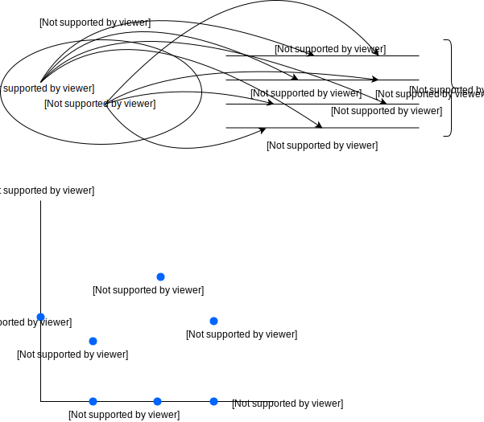
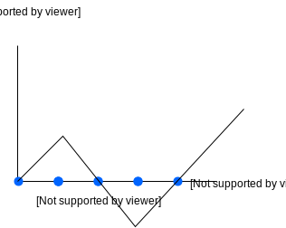

# Note 08 - Jan 31

# 4. Stochastic Processes

1. sequence / family of random variables
2. a random function (hard to formulate)

__Definition__: A __stochastic process__ $\{X_t\}_{t\in T}$ is a collection of random variables, defined on a common probability space.

$T$: index set. In most cases, $T$ corresponds to time, and is either discrete $\{0,1,2,\cdots\}$ or continuous $[0,\infty)$

In discrete case, we writes $\{X_n\}_{n=0,1,2,\ldots}$

This __state space__ $S$ os a stochastic process is the set of all possible value of $X_t, t\in T$

$S$ can also be either discrete or continuous. In this course, we typically deal with __discrete__ stat space. Then we relabel the stats so that $S=\{0,1,2,\cdots\}$ (countable state space) or $S=\{0,1,2,\cdots,M\}$ (finite state space)

__Remark__: As in the case of the joint distribution, we need the r.v's in a stochastic process to be defined on a common probability space, because we want to discuss their joint behaviours, i.t, how things change over time.

Thus, we can identify each point $\omega$ in the sample space $\Omega$ with a function defined on $T$ and taking value in $S$. Each function is called a __path__ of this stochastic process

__Example__ Let $X_0, X_1, \cdots$ be independent and identical r.v's following some distribution. Then $\{X_n\}_{n=0,1,2,...}$ is a stochastic process

__Example__ Let $X_1, X_2,...$ be independent and identical r.v.'s. $P(X_1=1)=p$, and $P(X_1=-1)=1-p$. Define $S_0=0, S_n=\sum_{i=1}^n X_i, n\leq 1$, e.g.

- $S_0=0$
- $S_1=X_1$
- $S_2=X_1+X_2$
- $\cdots\cdots$

Then $\{S_n\}_{n=0,1,...}$ is a stochastic process, with state space $S=\Z$ (integer)

$\{S_n\}_{n=0,1,...}$ is called a __"simple random walk"__. ($S_n=S_{n-1}+X_n$)

$$ 
S_n=\begin{cases}
S_{n-1} + 1     \\
S_{n-1} - 1
\end{cases}
$$

__Remark__: Why we need the concept of "stochastic process"? Why don't we just look at the joint distribution of $(X_0, X_1,...,X_n)$?

__Answer__: The joint distribution of a large number of r.v's is very complicated, because it does not take advantage of the special structure of $T$(time).

For example, simple random walk. The full distribution of $(S_0, S_1, ..., S_n$ is complicated or $n$ large. However, the structure is actually simple if we focus on the adjacent times:

$$
S_{n+1}=S_n+X_{n+1} \\S_n: \text{ last value. } \quad X_{n+1}: \text{related to }Ber(p). \text{ They are independent}
$$

By introducing time into the framework, we can greatly simplify many things.

More precisely, we fine that for simple random walk, $\{S_n\}_{n=0,1,...}$, if we know $S_n$ the distribution of $S_n+1$ will not depend on the history $(S_0, ..., S_n-1$. THis is a very useful property

In general for a stochastic process $\{X_n\}_{n=0,1,...}$, at time $n$, we already know $X_0, X_1,..., X_n$, $S_0$ our best estimate of the distribution of $X_{n+1}$ should be the conditional distribution:

$$
X_{n+1}|X_n,...,X_n
$$

given by:

$$
P(X_{n+1}=x_{n+1}|X_n=x_n,..., X_0=x_0)
$$

As time passes, the expression becomes more and more complicated $\rightarrow$ impossible to handle.

However, if we know that this conditional distribution is actually the same as the conditional distribution only given $X_n$, then the structure will remain simple for any time. This motivates the notion of _Markov chain_.