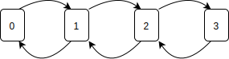
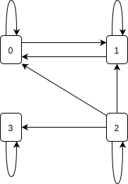

# Note 11 - Feb 26

# Review

## Solving or stationary distribution

$$
\begin{cases}
\begin{aligned}
    \underline{\pi}\cdot P &= \underline{\pi}   &\text{gives properties between components of }\underline{\pi}        \\
    \underline{\pi} \cdot 1\!\!\!\!\perp &= 1   &\text{normolize to get exact values}
\end{aligned}
\end{cases}
$$

## Classification

$$ T_i:=min\{n>0:X_n = i\} $$

$$
\begin{aligned}
    i\quad\quad & recureent & transient   \\
    &P(T_i<infty |X_0=i) = 1 \quad& P(T_i<\infty|X_0=i)<1    \\
    &P(V_i=\infty|X_0=i)=1&P(V_i<\infty|X_0=i)=1    \\
    &E(V_i|X_0=i)=\infty &E(V_i|X_0=i)<\infty   \\
    \text{easiest to use: } &\sum_{n=1}^\infty P_{ii}^{(n)}=\infty &\sum_{n=1}^\infty P_{ii}^{(n)}<\infty
\end{aligned}
$$

Recurrent$\begin{cases}
\begin{aligned}
    &\text{positive recurrent } &\text{if } \mathbb{E}(T_i|X_o=i)<\infty  \\
    &\text{null recurrent } &\text{if } \mathbb{E}(T_i|X_o=i)=\infty
\end{aligned}
\end{cases}$

# 4. Stochastic Processes (cont'd)

## 4.4. Classification of States (cont'd)

### 4.4.2 Periodicity

Example:
$$P=
\begin{pmatrix}
    & 1 & & \\
    \frac{1}{2} & & \frac{1}{2} & \\
    &\frac{1}{2}&&\frac{1}{2}\\
    &&1&
\end{pmatrix} $$

    

Note that if we starts from 0, we can only get back to 0 in $2, 4, 6,\cdots$, i.t., even number of steps $P_{00}^{(2n+1)}=0 \forall n$

#### Definition 4.4.2 : Period

The *__period__* of state $i$ is defined as
$$ d_i=\underbrace{gcd}_{\text{greates}\atop\text{common divisor}}(\{n:\underbrace{P_{ii}^{(n)}>0}_{\text{$i$ can go back} \atop\text{to $i$ in $n$ steps} }\}) $$

In this example above, $d_0=gcd(\{\text{even numbers}\}) = 2$

If $d_i=1$, state $i$ is called *__"aperiodic"__*

If $\not\exists n > 0$ such that $P_{ii}^{(n)}>0$, then $d_i=\infty$

#### Remark 4.4.2

Note that $P_{ii} > 0 \Rightarrow d_i = 1$. The converse is __not true__.

    

$$ P_{00}^{(2)} >0, P_{00}^{(3)} > 0 \Rightarrow d_0 =1 \text{ but } P_{00}=0$$

In general, $d_i=d \not\Rightarrow P_{ii}^{(d)}>0$

### 4.4.3 Equivalent classes and irreducibility

#### Definition 4.4.3.1 : Assessable

Let $\{X_n\}_n=0,1,\cdots$ be a DTMC with state space $S$. State $j$ is said to be $\text{\underline{assessable}}$ from state $i$, denoted by $i\rightarrow j$, if $P_{ij}^{(n)}>0$ for some $n\geq 0$.

Intuitively, $i$ can go to state $j$ in finite steps.

#### Definition 4.4.3.2 : Communicate

If $i\rightarrow j$ and $j\rightarrow i$, we say $i$ and $j$ __communicate__, denoted by $i\leftrightarrow j$.

#### Fact 4.4.3.1

"Communication" is an equivalence relation.

1. $i\leftrightarrow j$ then $P_{ii}^{(0)}= 1 \bold{=} P(X_0=i|X_0=i)$ (Identity)
2. $i\leftrightarrow j$ then $j\leftrightarrow i$ (symmetry)
3. $i\leftrightarrow j, j\leftrightarrow k$, then $i\leftrightarrow k$ (transitivity)

#### Definition 4.4.3.3 : Class

As a result, we can use "$\leftrightarrow$" to divide the state space into different *__classes__*, each containing only the states which communicate with each other.

$$ \begin{cases}
    S=\bigcup_kC_k \quad\quad\quad\quad \text{($\{C_n\}$ is a partition of $S$)}\\ 
    C_k\bigcap C_k' = \emptyset, k\not=k'
\end{cases} $$

- For state $i$ and $j$ in the same class $C_k$, $i\leftrightarrow j$. 
- For $i$ $j$ in different classes, $i\not\leftrightarrow j$ ($i\not\rightarrow j$ or $j\not\rightarrow i$)

#### Definition 4.4.3.4 : Irreducible

A MC is called __irreducible__, if it has only one class. In other words, $i\leftrightarrow j$ for any $i, j\in S$

 

-Q: How to find equivalent classes?

-A: "Draw a graph and find the loops"

#### Example 4.4.3.1 : Find the classes

$$ P=\begin{pmatrix}
    \frac{1}{2} & \frac{1}{2} & & \\
    \frac{1}{2}&\frac{1}{2}&&\\
    \frac{1}{4}&\frac{1}{4}&\frac{1}{4}&\\
    &&&1
\end{pmatrix} $$

Draw an arrow from $i$ to $j$ if $P_{ij} > 0$

    

- $P_{01}>0, P{10}>0 \Rightarrow 0\leftrightarrow1$
- State 2 does not communicate with any other state, since $P_{i2}=0, i\not=2$
- State 3 does not communicate with any other state, since $P_{i3}=0, i\not=3$

$\Rightarrow$ 3 classes: $\{0,1\}, \{2\}, \{3\}$

#### Example 4.4.3.2 : Find the classes

$$ P=\begin{pmatrix}
    \frac{1}{2} & \frac{1}{2} & & \\
    \frac{1}{2}&&\frac{1}{2}&\\
    \frac{1}{2}&&&\frac{1}{2}\\
    &&\frac{1}{2}&\frac{1}{2}
\end{pmatrix} $$

    

- $P_{01}, P_{12}, P_{20} > 0 \Rightarrow 0,1,2$ are in the same class
- $P_{23}, P_{32} > 0 \Rightarrow 2,3$ are in the same class
- Transitivity $\Rightarrow$ 0,1,2,3 are all in the same class.

$\Rightarrow$ This MC is irreducible

#### Fact 4.4.3.2

Preposition Transience/Recurrence are class properties. That is, if $i\leftrightarrow j$, then $j$ is transient/recurrent if and only if $i$ is transient/recurrent

__Proof__:

Suppose $i$ is recurrent, then $\sum_{k=1}^\infty P_{ii}^{(k)}=\infty$

Since $i \leftrightarrow j$, $\exists m,n$ such that $P_{ij}^{(m)}>0, P_{ij}^{(n)}>0$

Note that 
$$
\begin{aligned}
\underbrace{P_{jj}^{(m+n+k)}}_{P(X_{m+n+k}=j|X_0=j)} \geq \underbrace{P_{ji}^{(n)}P_{ii}^{(k)}P_{ij}^{(m)}}_{P(X_{m+n+k}=j, X_{n+k}=i, X_n=i|X_0=j)} 
     \Rightarrow \sum_{l=1}^\infty P_{jj}^{(l)} 
        &\geq \sum_{l=m+n+1}^\infty P_{jj}^{(l)}    \\
        & = \sum_{k=1}^\infty P_{jj}^{(m+n+k)}  \\
        & \geq \sum_{k=1}^\infty P_{ji}^{(n)}P_{ii}^{(k)}P_{ji}^{(m)}   \\
        & = \underbrace{P_{jj}^{(n)}}_{0}\underbrace{P_{ij}^{(m)}}_{0}\   \underbrace{\sum_{k=1}^\infty P_{ii}^{(k)}}_\infty = \infty
\end{aligned}
$$

Thus, $j$ is recurrent. Symmetrically, $j$ is recurrent $\Rightarrow$ $i$ is recurrent

Thus,

- $i$ recurrent $\Leftrightarrow$ $j$ recurrent
- $i$ transient $\Leftrightarrow$ $j$ transient

For irreducible MC, since recurrence and transience are class properties, we also say the Markov Chain is recurrent/transient
