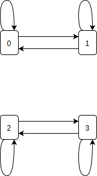

# Note 13 - Feb 28

# 4. Stochastic Processes (cont'd)

## 4.4. Classification of States (cont'd)

### 4.4.3 Equivalent classes and irreducibility (cont'd)

#### Definition 4.4.3.5 : Proposition

If an irreducible MC has a finite state space, then it is recurrent

__Idea of proof__

If the MC is transient, then with probability 1, each state has a last visit time. Finite states $\Rightarrow$ $\exists$ a last visit time for all the states. As a result, the MC has nowhere to go after that time. $\Rightarrow$ Contradiction.

#### Remark 4.4.3.1

We can actually prove that the MC must be positive recurrent, if the state space is finite and the MC is irreducible.

#### Theorem 4.4.3.1

Periodicity is a class property: $i\leftrightarrow j\Rightarrow d_i=d_j$.

For an irreducible MC, its period is defined as the period of any state.

## 4.5 Limiting Distribution

In this part, we are interested in $lim_{n\rightarrow\infty} P_{ij}^{(n)}$ and $lim_{n\rightarrow\infty}P(X_u=i)$

To make things simple, we focus on the irreducible case.

### Theorem 4.5.1 : Basic Limit Theorem

Let $\{X_n\}_{n=0,1,\ldots}$ be an __irreducible, aperiodic, positive recurrent__ DTMC. Then a unique stationary distribution:
$$ \underline{\pi}=(\pi_0,\pi_1,\ldots) \text{ exits} $$
Moreover:
$$ 

(*)\underbrace{lim_{n-\rightarrow\infty} P_{ij}^{(n)}}_{\text{limiting distribution}\atop\text{(does not depend on the initial state i)} }

=lim_{n\rightarrow\infty}
\underbrace{\frac{\sum_{k=1}^n1\!\!\!\!\perp_{\{X_k=j\}}}{n}}_{\text{long-run fraction of time spent in j}}

=\underbrace{\frac{1}{\mathbb{E}(T_j|X_0=j)}}_{\text{$T_j=min\{n>0:X_n=j\}$}\atop\text{expected revisit time}}

=\pi_j\quad\quad, i,j\in S

$$

Limiting distribution =

- long-run fraction of time
- $1 /$ expected revisit time
- stationary distribution

### Remark 4.5.1

The result $(*)$ is still true if the MC is null recurrent, where all the terms are __0__, and $\underline{\pi}$ is no longer a distribution. (in other words, there does not exist a stationary distribution)

### Remark 4.5.2 : periodic extension

If $\{X_n\}_{n=0,1,\ldots}$ has a period $d>1$:
$$ 

\frac{\lim_{n\rightarrow\infty} P_{jj}^{(nd)}}{d}

= \lim_{n\rightarrow\infty}\frac{\sum_{k=1}^n1\!\!\!\!\perp_{\{X_k=j\}}}{n}

= \quad\frac{1}{\mathbb{E}(T_j|X_0=j)}=\pi_j

$$

Back  to the aperiodic case. SInce the limit $\lim_{n\rightarrow\infty}P_{ij}^{(n)}$ does not depend on $i$, $\lim_{n\rightarrow\infty}P_{ij}^{(n)}=\pi_j$ is also the limiting(marginal) distribution at state $j$:
$$ \lim_{n\rightarrow\infty}\alpha_{n,j} = \lim_{n\rightarrow\infty}P(X_n=j)=\pi_j $$
regardless of the initial distribution $\alpha_0$

__Detail:__

$$
\begin{aligned}
    \lim_{n\rightarrow\infty}\alpha_{n,j} 
        & = \lim_{n\rightarrow\infty}(\alpha_0\cdot p^{(n)})_j \\
        & = \lim_{n\rightarrow\infty}\sum_{i\in S}\alpha_{0,i}\cdot P_{ij}^{(n)} \\
        & = \sum_{i\in S}\lim_{n\rightarrow\infty}\alpha_{0,i}\cdot P_{ij}^{(n)} \\
        & = \sum_{i\in S}\alpha_{0,i}\lim_{n\rightarrow\infty}\cdot P_{ij}^{(n)} \\
        & = (\sum_{i\in S}\alpha_{0,i})\pi_j    \\
        & = \pi_j
\end{aligned}
$$

Why are the conditions in the _Basic Limit Theorem_ necessary?

### Example 4.5.1

Consider a MC with

$$ p=\begin{pmatrix}
    \frac{1}{2} & \frac{1}{2} & & \\
    \frac{1}{2} & \frac{1}{2} & & \\
    & & \frac{1}{2} & \frac{1}{2} \\
    & & \frac{1}{2} & \frac{1}{2}
\end{pmatrix} $$

    

Two classes: $\{0,1\}, \{2, 3\}$ $\Rightarrow$ it is __not__ irreducible. All the states are still aperiodic, positive recurrent

This MC can be decomposed into two MC's:

State $0, 1$, with
$$ p_1=\begin{pmatrix}
    \frac{1}{2} & \frac{1}{2} \\\\
    \frac{1}{2} & \frac{1}{2}
\end{pmatrix} \quad\quad \text{irreducible}$$

State $2, 3$, with
$$ p_1=\begin{pmatrix}
    \frac{1}{2} & \frac{1}{2} \\\\
    \frac{1}{2} & \frac{1}{2}
\end{pmatrix} \quad\quad \text{irreducible}$$

And
$$ p=\begin{pmatrix}
    P_1 & \\
    & P_2
\end{pmatrix} $$

Note that both $(\frac{1}{2},\frac{1}{2},0,0)$ and $(0,0,\frac{1}{2},\frac{1}{2})$ are stationary distributions. Consequently, any convex combination of these two distributions, of the form:
$$ a(\frac{1}{2},\frac{1}{2},0,0) + (1-a)(0,0,\frac{1}{2},\frac{1}{2})\quad, a\in\{0,1\} $$
is also a stationary distribution

Thus, irreducibility is related to the uniqueness of the stationary distribution.

Correspondingly, the limiting transition probability will depend on $i$:

$$ \lim_{n\rightarrow\infty}P_{00}^{(n)} = (\lim_{n\rightarrow\infty}P_1^n)_{00}=\frac{1}{2} $$

but $\lim_{n\rightarrow\infty}P_{20}^{(n)}=0$

### Example 4.5.2
Consider a MC with
$$ p = \begin{pmatrix}
0 & 1\\
1 & 0
\end{pmatrix} $$

    

Irreducible, positive recurrent, but not aperiodic: $d=2$

Note that $p^2=\begin{pmatrix}1&\\&1\end{pmatrix}=I\Rightarrow p^{2n}=\begin{pmatrix}1&\\&1\end{pmatrix}, p^{2n+1}=p=\begin{pmatrix}&1\\1\end{pmatrix}$

$p_{00}^{(n)}=1$ for $n$ even, $0$ for $n$ odd $\Rightarrow$ $\lim_{n\rightarrow\infty}P_{00}^{(n)}$ does not exist.

Aperiodicity is related to the existence of the limit $\lim_{n\rightarrow\infty}P_{ij}^{(n)}$
