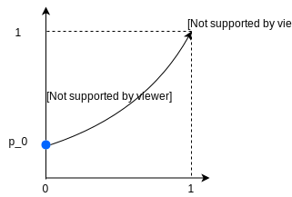
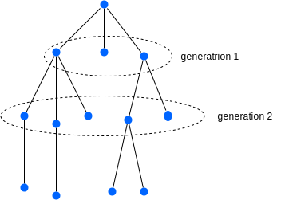
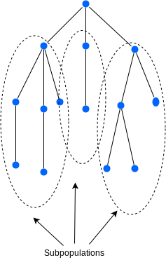
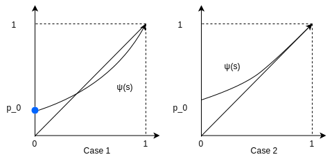

# Note 15 - Mar 07

# Review

Positive recurrence is related to the existence of the stationary distribution.

generating function:

$$
\begin{aligned}
 \psi(s) & = \mathbb{E}(s^\xi)  \\
         & = \sum_{k=0}^\infty \underbrace{P_k}_{\mathbb{P}(\xi=k),k=0,1,...}S^k \quad for 0 \leq s \leq 1
\end{aligned}
 $$

Properties

1. $\psi(0)=p_0,\quad\psi(1)=\sum_{k=0}^\infty p_k=1$
2. Generating function determines the distribution 
   $$ p_k=\frac{1}{k!}\frac{d^k\psi(s)}{ds^k}|_{s=0}$$

generating function determines the ditribution.

$$ \frac{d^k\psi(s)}{ds^k}=k!P_k + (...)s + (...)S^2+... $$

Since $P_k\geq 0$ for all $k=0,1,...$, $\frac{d^k\psi(s)}{ds^k}\geq 0$ for all $k=1,2,...$, $s\in[0,1]$.

In particular, $\psi(s)$ is increasing and convex between 0 and 1

# 4. Stochastic Processes (cont'd)

## 4.6 Generating function and branching processes

### Properties of generating function

1. $\psi(0)=p_0,\quad\psi(1)=\sum_{k=0}^\infty p_k=1$
2. Generating function determines the distribution 
   $$ p_k=\frac{1}{k!}\frac{d^k\psi(s)}{ds^k}|_{s=0}$$
   Reason:
   $$ \psi(s)=p_0+p_1s^1+\cdots+p_{k-1}s^{k-1}+p_ks^k+p_{k+1}s^{k+1}+\cdots \\$$
   $$\frac{d^k\psi(s)}{ds^k}=k!p_k +(\cdots)s +(\cdots)s^2+\cdots$$
   $$ \frac{d^k\psi(s)}{ds^k}|_{s=0}=k!p_k $$
   In particular, $p_1\geq 0\Rightarrow\psi(s)$ is increasing. $p_2\geq 0\Rightarrow \psi(s)$ is climax
3. Let $\xi_1,...,\xi_n$ be independent r.b. with generating function $\psi_1,...,\psi_n$,
    $$ X=\xi_1+...+\xi_n \Rightarrow \psi_X(s)=\psi_1(s)\psi_2(s)...\psi_n(s)$$
    __Proof__:
    $$ \begin{aligned}
        \psi_X(s)   &= \mathbb{s^X}   \\
    (independent)  &= \mathbb{E}(s^{\xi_1}s^{\xi_2}...s^{\xi_n})   \\
                    &= \mathbb{E}(s^{\xi_1})...\mathbb{E}(s^{\xi_n})\\
                    &= \psi_1(s)...\psi_n(s)
    \end{aligned} $$
4. $$\frac{d^\psi(s)}{ds^k}\bigg|_{s=1} =
   \frac{d^k\mathbb{E}(s^\xi)}{ds^k}\bigg|_{s=1} =
   \mathbb{E}(\frac{d^ks^\xi}{ds^k}\bigg|_{s=1} =
   \mathbb{E}(\xi(\xi-1)(\xi-2)...(\xi-k+1)s^{\xi-k})\bigg|_{s=1} =
   \mathbb{E}(\xi(\xi-1)...(\xi-k+1))$$
   In particular, $\mathbb{E}(\xi) = \psi'(1)$ and $Var(\xi)=\mathbb{E}(\xi^2)-(\mathbb{E}(\xi))^2=\mathbb{E}(\xi^2-\xi)+\mathbb{E}(\xi)-(\mathbb{E}(\xi))^2 = \psi''(1)+\psi(1)-(\psi'(1))^2$

   Graph of a g.f.:
    

        
    

### 4.6.1 Branching Process

Each organism, at the end of its life, produces a random number $Y$ of offsprings.

$$ \mathbb{P}(Y=k)=P_k, \quad k=0,1,2,..., \quad P_k\geq 0,\quad \sum_{k=0}^\infty P_k=1 $$

The number of offsprings of different individuals are independent.

Start from one ancestor $X_0=1$, $X_n:$ # of individuals(population in $n$-th generation)

    

Then $X_n+1=Y_1^{(n)}+Y_2^{(n)}+...+Y_{X_n}^{(n)}$, where $Y_1^{(n)},...,Y_{X_n}^{(n)}$ are independent copies of $Y, Y_i^{(n)}$ is the number of offsprings of the $i$-th individual in the $n$-th generation

#### 4.6.1.2 Mean and Variance

Mean: $\mathbb{E}(X_n)$ and Variance: $Var(X_n)$

Assume, $\mathbb{E}(Y)=\mu, Var(Y)=\sigma^2$.

$$ \begin{aligned}
\mathbb{E}(X_{n+1})
    &= \mathbb{E}(Y_1^{(n)}+...+Y_{X_n}^{(n)})  \\
    &= \mathbb{E}(\mathbb{E}(Y_1^{(n)}+...+Y_{X_n}^{(n)}|X_n))  \\
    &= \mathbb{E}(X_n\mu)   \\
\text{Wald's identity(tutorial 3)} \quad   &= \mu\mathbb{E}(X_n)\\
\end{aligned} $$

$$ 
\begin{aligned}
\Rightarrow \mathbb{X_n}
    &=\mu\mathbb{E}(X_{n-1})   \\
    &=\mu^2\mathbb{X_{n-2}}     \\
    &\quad\quad\quad\vdots   \\
    &=\mu^n\mathbb{E}(X_0) = \mu^n,\quad n=0,1,...
\end{aligned}
$$

$$
\begin{aligned}
Var(X_{n+1})
    &= \mathbb{E}(Var(X_{n+1}|X_n)+Var(\mathbb{E})X_{n+1}|X_n)  \\ \\
\begin{aligned}

\mathbb{E}(Var(X_{n+1}|X_n))
    &=\mathbb{E}(Var(Y_1^{(n)+...+Y_{X_N}^{(N)}}|X_N))\\
    &=\mathbb{E}(X_n\cdot\sigma^2)  \\
    &= \sigma^2\mu^n
\end{aligned}\quad\quad
&\begin{aligned}
Var(\mathbb{E}(X_{n+1}|X_n))
    &= Var(\mu X_n) \\
    &= \mu^2Var(X_u)\   \\
    &\begin{aligned}
        \Rightarrow 
            &Var(X_{n+1}) = \sigma^2\mu^n+\mu^2Var(X_n))\\
            &Var(X_1)=\sigma^2 \\
            &Var(X_2)=\sigma^2\mu + \mu^2\sigma^2=\sigma^2(\mu^1+\mu^2) \\
            &Var(X_3)=\sigma^2\mu^2+\mu^2(\sigma^2(\mu^1+\mu^2)) = \sigma^2(\mu^2 + \mu^3 + \mu^4)\\
            &\quad\quad\quad\vdots\\
            &\text{In general, (can be proved by induction)}\\
            &\begin{aligned}
                Var(X_n)&=\sigma(\mu^{n-1}+...+\mu^{2n-2})\\
                &=\begin{cases}
                \begin{aligned}
                    &\sigma^2\mu^{n-1}\frac{1-\mu^n}{1-\mu} \quad&\mu\not=1\\
                    &\sigma^2n &\mu=1
                \end{aligned}
                \end{cases}
            \end{aligned}
    \end{aligned}
\end{aligned}
\end{aligned}
$$

#### 4.6.1.2 Extinction Probability

Q: What is the probability that the population size is eventually reduced to 0

Note that for a branching process, $X_n=0\Rightarrow X_k=0$ for all $k\geq n$. Thus, state $0$ is absorbing. $(P_{00}=1)$. Let $N$ be the time that extinction happens.
$$ N=min\{n:X_n=0\} $$
Define
$$U_n=\mathbb{P}(\underbrace{N\leq n}_{\text{extinction happens}\atop\text{before or at n}})=\mathbb{P}(X_n=0)$$
Then $U_n$ is increasing in $n$, and
$$
\begin{aligned}
u=\lim_{n\rightarrow\infty}U_n
    &= \mathbb{P}(N<\infty) \\
    &= P(\text{the extinction eventually happens})  \\
    &= \text{extinction probability}
\end{aligned}
$$
Out goal : find $u$

We have the following relation between $U_n$ and $U_{n-1}$:
$$ U_n=\sum_{k=0}^\infty P_k(U_{n-1})^k = \underbrace{\psi}_{\text{gf of Y}}(U_{n-1}) $$

    

Each subpopulation has the same distribution as the whole population.

Total population dies out in $n$ steps if and only if each subpopulation dies out int $n-1$ steps

$$ \begin{aligned}
U_n
    &= \mathbb{P}(N\leq n)  \\
    &= \sum_k \mathbb{P}(N\leq n|X_1 = k)\underbrace{\mathbb{P}(X_1=k)}_{=P_k}  \\
    &=\sum_k \mathbb{P}(\underbrace{N_1\leq n-1}_{\text{\# of steps for subpopulation 1 to die out}},\cdots, N_k\leq n-1|X_1=k)\cdot P_k    \\
    &= \sum_k P_k\cdot U_{n-1}^k    \\
    &= \mathbb{E}(U_{n-1}^Y)  \\
    &= \psi(U_{n-1})
\end{aligned} $$

Thus, the question is :

$\quad$ With initial value $U_0=0$ (since $X_0=1$), relation $U_n=\psi(U_{n-1})$. What is $\lim_{n\rightarrow\infty}U_N=u$?

Recall that we have

1. $\psi(0)=P_0\geq 0$
2. $\psi(1) = 1$
3. $\psi(s)$ is increasing
4. $\psi(s)$ is convex

Draw $\psi(s)$ and function $f(s)=s$ between 0 and 1, we have two cases:

    

The extinction probability $u$ will be the smallest intersection of $\psi(s)$ and $f(s)$. Equivalently, it is the smallest solution of the equation $\psi(s)=s$ between 0 and 1.