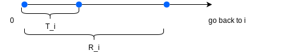
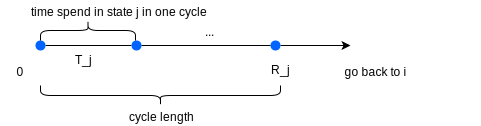

# Note 21 - Mar 28

# Review

## Generator

$$ R=\lim_{n\rightarrow 0^+}\frac{p(n)-I}{n} $$
$$ R_{ii} = -\lambda_i,\quad R_{ij}=\lambda_i q_{ij} \\
\text{Row sums of $R$ are $0$}$$
$$ \lambda_i=-R_{ii},\quad q_{ij}=-\frac{R_{ij}}{R_{ii}},\quad i\cancel{=}j $$

# 6. Continuous-Time Markov Chain (cont'd)

## 6.3. Classification of States

The matrix $Q$ is a transition matrix of a DTMC ($q_{ij}\geq 0,\quad \sum_{j\in S}q_{ij}=1$), It contains all the information about the state changes, but "forget" the time.

Since *__accessibility, communication, irreducibility, recurrence/transience__* are only related to the change of states, not the time, these properties will be the same for the CTMC and its discrete skeleton.

For a CTMC $\{X(t)\}_{t\geq 0}$, we call "state $j$ is accessible from state $i$", "$i$ and $j$ communicate", "the process is irreducible", "$i$ is recurrent/transient" if and only if this is the case for its discrete skeleton.

### 6.3.1. Positive / Null Recurrence

Note that since __positive/null recurrence__ do involve the (expected) amount of time, we can indeed have different results for a CTMC and its discrete skeleton.

Let $R_i$ be the amount of (continuous, random) time the MC (re)visits state $i$.

    

A state $i$ is called positive recurrent, if it is recurrent, and $\mathbb{E}(R_i|X(0)=i)<\infty$. It is called null recurrent, if it is recurrent and $\mathbb{E}(R_i|X(0)=i)=\infty$

As in the discrete-time case, the positive recurrence, null recurrence and transience are class property

## 6.4. Stationary Distribution

### Definition 6.4.1. Stationary Distribution

A distribution $\underline{\pi}=(\pi_0,\pi_1,\cdots)$ is called a stationary distribution of a CTMC $\{X(t)\}_{t\geq 0}$ with generator $R$ is it satisfies:

1. $\underline{\pi}\cdot R=0 \rightarrow (0,0,\cdots)$
2. $\sum_{i\in S}\pi_i=1\quad$ ($\underline{\pi}\cdot 1\!\!\!\!\perp = 1$)

Q: Why such a $\underline{\pi}$ is called stationary?

A: Assume the process starts from the initial distribution $\underline{\alpha^{(0)}}=\underline{\pi}$:
$$ \mathbb{P}(X(0)=i)=\pi_i $$
Then the distribution at time $t$ is given by
$$ \underline{\alpha}^{(t)}=\underline{\alpha}^{(0)}\cdot P(t)=\underline{\pi}\cdot P(t) $$
Reason:
$$ \begin{aligned}
    \alpha_j^{(t)}
        &= \mathbb{P}(X(t)=j)\\
        &= \sum_{i\in S}\mathbb{P}(X(t)=j|X(0)=i)\mathbb{P}(X(0)=i)\\
        &= \sum_{i\in S}P_{ij}(t)\cdot \alpha_i^{(0)}\\
        &=(\underline{\alpha}^{(i)}\cdot P(t))_j\\
\end{aligned} $$
$$
\begin{aligned}
    \Rightarrow \frac{d}{dt}(\underline(\alpha)^{(t)} )
        &= \frac{d}{dt}(\underline{\pi}\cdot P(t))   \\
        &= \underline{\pi}(\frac{d}{dt} P(t))    \\
    \text{c-k equation}    &= \underline{\pi}\lim_{n\rightarrow 0^+}\frac{P(t+n)-p(t)}{t}  \\
        &= \underline{\pi}\lim_{n\rightarrow 0^+}\frac{P(n)P(t)-P(t)}{n}    \\
        &= \underline{\pi}(\lim_{n\rightarrow 0^+}\frac{P(n) - I}{n})P(t)    \\
     \underline{0}   &=  \underline{\pi}\cdot R\cdot P(t)   \\
        &= \underline(0)
\end{aligned}
$$
$\Rightarrow \underline{\alpha}(t)$ is a constant (vector)

In other words, the distribution of $X(t)$ will not change over time, if the MC start from the stationary distribution.

### Fact 6.4.1. Stationary Distribution

If a CTMC starts from a stationary distribution, then its distribution will never change.

### Remark 6.4.1. Kolmogorov's Backward Equation

In the above derivation, we also see that
$$ \frac{d}{dt}(P(t)) = P'(t)=R\cdot P(t) $$
This is called the __Kolmogorov's Backward Equation__

### 6.4.1. Basic Limit Theorem for CTMC

Let $\{X(t)\}_{t\geq 0}$ be an irreducible, recurrent CTMC. Then

$$ \lim_{t\rightarrow\infty}P_{ij}(t)=:\pi_j'=\frac{\mathbb{E}(T_j)}{\mathbb{E}(R_j|X(0)=j)} = \frac{1/\lambda_i}{\mathbb{E}(R_j|X(0)=j)}$$

In addition, the MC is positive recurrent if and only if an unique stationary distribution exists. In this case, the stationary distribution is $\underline{\pi}'=(\pi_0',\pi_1',\cdots)$

#### Remark 6.4.1.1

    

$$ \frac{\mathbb{E}(T_j)}{\mathbb{E}(R_j|X(0)=j)} = \text{long-run fraction of time spent in state $j$} $$

Thus, $\pi_j'$ is also the long-run fraction of time that the process spends in stat $j$.

## 6.5. Birth and Death Processes

### Definition 6.5.1. Birth and Death Process

A __Birth and Death Process__ is a CTMC such that $S=\{0,1,\cdots, M\}$, or $S=\{0,1,\cdots\}$, and $\underline{q_{ij}=0}$ if $\underline{|j-i|>1}$.

The process can only change to neighbouring states:

$$ q_{i,i-1}+q_{i,i+1} = 1,\quad i\geq 1 $$
$$ q_{01} = 1 $$
