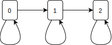

# STAT 333 Course Note

# Table of Contents

- [STAT 333 Course Note](#stat-333-course-note)
- [Table of Contents](#table-of-contents)
- [1. Fundamental of Probability](#1-fundamental-of-probability)
  - [1.1. What's Probability](#11-whats-probability)
    - [1.1.1. Examples](#111-examples)
      - [Example 1](#example-1)
  - [1.2. Probability Models](#12-probability-models)
    - [1.2.1. Examples](#121-examples)
      - [1.2.1.1. Example 2](#1211-example-2)
    - [1.2.2. Remark: why do we need the notion of event?](#122-remark-why-do-we-need-the-notion-of-event)
  - [1.3. Conditional Probability](#13-conditional-probability)
  - [1.4. Independence](#14-independence)
  - [1.5. Bayes' rule and law of total probability](#15-bayes-rule-and-law-of-total-probability)
    - [1.5.1. Bayes' rule](#151-bayes-rule)
- [2. Random variables and distributions](#2-random-variables-and-distributions)
  - [2.1. Random variables](#21-random-variables)
  - [2.2. Discrete random variables and distributions](#22-discrete-random-variables-and-distributions)
    - [2.2.1. Examples of discrete distributions](#221-examples-of-discrete-distributions)
      - [1. Bemoulli distribution](#1-bemoulli-distribution)
      - [2.Binomial distribution](#2binomial-distribution)
      - [3.Geometric distribution](#3geometric-distribution)
      - [4. Poisson distribution](#4-poisson-distribution)
  - [2.3. Continuous random variables and distributions](#23-continuous-random-variables-and-distributions)
    - [2.3.1. Example of continuous distribution](#231-example-of-continuous-distribution)
  - [2.4. Joint distribution of r.v's](#24-joint-distribution-of-rvs)
  - [2.5. Expectation](#25-expectation)
    - [2.5.1. Properties of expectation](#251-properties-of-expectation)
    - [2.5.2. Definitions](#252-definitions)
  - [2.6. Indicator](#26-indicator)
    - [2.6.1. Example](#261-example)
    - [2.6.1. Example 3](#261-example-3)
  - [2.7. Moment generating function](#27-moment-generating-function)
    - [2.7.1. Properties of mgf](#271-properties-of-mgf)
    - [2.7.2. Joint mgf](#272-joint-mgf)
      - [2.7.2.1. Properties of the joint mgf](#2721-properties-of-the-joint-mgf)
- [3. Conditional distribution and conditional expectation](#3-conditional-distribution-and-conditional-expectation)
  - [3.1. Conditional distribution](#31-conditional-distribution)
    - [3.1.1. Discrete case](#311-discrete-case)
      - [3.1.1.1. Example](#3111-example)
    - [3.1.2. Continuous case](#312-continuous-case)
      - [3.1.2.1. Example](#3121-example)
      - [3.1.2.1. Example 2](#3121-example-2)
  - [3.2. Conditional expectation](#32-conditional-expectation)
    - [3.2.1. What is $\mathbb{E}(X|Y)\;?$](#321-what-is-mathbbexy)
    - [3.2.2. Properties of conditional expectation](#322-properties-of-conditional-expectation)
  - [3.3. Decomposition of variance (EVVE's low)](#33-decomposition-of-variance-evves-low)
- [4. Stochastic Processes](#4-stochastic-processes)
  - [4.1. Markov Chain](#41-markov-chain)
    - [4.1.1. Simple Random Walk](#411-simple-random-walk)
    - [4.1.2. Markov Chain](#412-markov-chain)
      - [4.1.2.1. Discrete-time Markov Chain](#4121-discrete-time-markov-chain)
        - [Definition and Examples](#definition-and-examples)
        - [Example: simple random walk](#example-simple-random-walk)
    - [4.1.3. One-step transition probability matrix](#413-one-step-transition-probability-matrix)
      - [Example 4.1.3.1. simple random walk](#example-4131-simple-random-walk)
      - [Example 4.1.3.2. Ehrenfest's urn](#example-4132-ehrenfests-urn)
      - [Example 4.1.3.3: Gambler's ruin](#example-4133-gamblers-ruin)
      - [Example 4.1.3.4: Bonus-Malus system](#example-4134-bonus-malus-system)
  - [4.2. Chapman-Kolmogorov equations](#42-chapman-kolmogorov-equations)
    - [4.2.1. Conditional Law of total probability](#421-conditional-law-of-total-probability)
    - [4.2.2. Distribution of $X_n$](#422-distribution-of-x_n)
  - [4.3. Stationary distribution (invariant distribution)](#43-stationary-distribution-invariant-distribution)
    - [Example 4.3.1](#example-431)
  - [4.4. Classification of States](#44-classification-of-states)
    - [4.4.1. Transience and Recurrence](#441-transience-and-recurrence)
      - [Definition 4.4.1. Transience and Recurrence](#definition-441-transience-and-recurrence)
      - [Example 4.4.1](#example-441)
    - [4.4.2. Periodicity](#442-periodicity)
      - [Definition 4.4.2. Period](#definition-442-period)
      - [Remark 4.4.2](#remark-442)
    - [4.4.3. Equivalent classes and irreducibility](#443-equivalent-classes-and-irreducibility)
      - [Definition 4.4.3.1. Assessable](#definition-4431-assessable)
      - [Definition 4.4.3.2. Communicate](#definition-4432-communicate)
      - [Fact 4.4.3.1](#fact-4431)
      - [Definition 4.4.3.3. Class](#definition-4433-class)
      - [Definition 4.4.3. Irreducible](#definition-443-irreducible)
      - [Example 4.4.3.1. Find the classes](#example-4431-find-the-classes)
      - [Example 4.4.3.2. Find the classes](#example-4432-find-the-classes)
      - [Fact 4.4.3.2](#fact-4432)
      - [Definition 4.4.3.5. Proposition](#definition-4435-proposition)
      - [Remark 4.4.3.1](#remark-4431)
      - [Theorem 4.4.3.1](#theorem-4431)
  - [4.5. Limiting Distribution](#45-limiting-distribution)
    - [Theorem 4.5.1. Basic Limit Theorem](#theorem-451-basic-limit-theorem)
    - [Remark 4.5.1](#remark-451)
    - [Remark 4.5.2](#remark-452)
    - [Example 4.5.1](#example-451)
    - [Example 4.5.2](#example-452)
    - [Example 4.5.3](#example-453)
    - [Example 4.5.4. Electron](#example-454-electron)
  - [4.6. Generating function and branching processes](#46-generating-function-and-branching-processes)
    - [Definition 4.6.1](#definition-461)
    - [Properties of generating function](#properties-of-generating-function)
  - [4.6. Generating function and branching processes](#46-generating-function-and-branching-processes-1)
    - [Properties of generating function](#properties-of-generating-function-1)
    - [4.6.1. Branching Process](#461-branching-process)
      - [4.6.1.2. Mean and Variance](#4612-mean-and-variance)
      - [4.6.1.2. Extinction Probability](#4612-extinction-probability)
- [5. Poisson Processes](#5-poisson-processes)
  - [5.1. Counting Process](#51-counting-process)
    - [Definition 5.1.1. Counting Process $N(t)$](#definition-511-counting-process-nt)
    - [Example 5.1.1](#example-511)
    - [Properties of a counting process](#properties-of-a-counting-process)
  - [5.2. Definition of Poisson Process](#52-definition-of-poisson-process)
    - [Interarrival Times](#interarrival-times)
    - [Definition 5.2.1. Renewal Process](#definition-521-renewal-process)
    - [Definition 5.2.2. Poisson Process](#definition-522-poisson-process)

# 1. Fundamental of Probability

## 1.1. What's Probability

### 1.1.1. Examples

1. Coin toss
   - "H" - head
   - "T" - tail
2. Roll a dice
   - every number in the set: $\{1,2,3,4,5,6\}$
3. Tomorrow weather
   - {sunny, rainy, cloudy,...}
4. Randomly pick a number in $[0, 1]$

Although things are random, they are not haphazard/arbitrary. There are "patterns"

#### Example 1

If we repeat tossing a coin, then the fraction of times that we get a "H" goes to $\frac{1}{2}$ as the number of toss goes to infinity.
$$
\frac{\#\; of \;"H"}{total\; \#\; of\; toss} = \frac{1}{2}
$$
This number $1/2$ reflects how "likely" a "H" will appear in one toss (if the experiment is not repeated)

## 1.2. Probability Models

The _Sample space_ $\Omega$ is the set consisting of al the possible outcomes of a random experiment.

### 1.2.1. Examples

1. $\{H, T\}$
2. $\{1,2,3,4,5,6\}$
3. $\{sunny, rainy, cloudy, ...\}$
4. $[0, 1]$

An _event_ $E\in \Omega$ is a subset of $\Omega$

for which we can talk about "likelihood of happening"; for example

- in __2__:
  - {getting an even number} = {2, 4, 6}
- in __4__:
  - $\{the \;point\; is\; between\; 0\; and\; 1/3\} = [0, \frac{1}{3}]$ is an event
  - $\{the\; point\; is\; rational\} = Q \cap [0, 1]$

We say an event $E$ "happens", if the result of the experiment turns out to belong to $E$ (a subset of $\Omega$)

A probability $P$ is a set function ( a mapping from events to real numbers)
$$
\begin{aligned}
P: & \xi \rightarrow R \\
   & E \rightarrow P(E)
\end{aligned}
$$

which satisfies the following 3 properties:

1. $\forall E \in \xi, 0 \leq P(E) \leq 1$
2. $P(\Omega) = 1$
3. For
   - countably many disjoint events $E_1, E_2,...,$ we have $P(U_{i=1}^{\infty}E_i) = \sum_{i=1}^{\infty}P(E_i)$
   - countable: $\exists$ 1-1 mapping to natural numbers $1,2,3,...$

Intuitively, one can think the probability of an event as the "likelihood/chance" for the event happens. If we repeat the experiment for a large number of events, the probability is the fraction of time that the event happens

$$
P(E) = \lim_{n\rightarrow\infty} \frac{\text{\# of times the E happens in n trials}}{n}
$$

#### 1.2.1.1. Example 2

$$
\begin{aligned}
&P(\{1\})=P(\{2\})=\ldots=P(\{6\})=\frac{1}{6} \\
&E = \{\text{even number}\} = \{2,4,6\} \\
\Rightarrow \;\; &P(E) = P(\{2\}\cup P(\{4\})) \cup P(\{6\}) = \frac{1}{2}
\end{aligned}
$$

Properties of probability:

1. $P(E) + P(E^c) = 1$
2. $P(\emptyset)=0$
3. $E_1\subseteq E_2 \Rightarrow P(E_1)\leq P(E_2)$
4. $P(E_1 \cup E_2) = P(E_1) + P(E_2) - P(E_1 \cap E_2)$
   -$P(E_1 \cap E_2)$: $E_1$ and $E_2$ happen

### 1.2.2. Remark: why do we need the notion of event?

If the sample space $\Omega$ is __discrete__, then everything can has at most countable elements be built from the "atoms"
$$
\begin{aligned}
\Omega = \{w_1, w_2, \ldots\} \\
P(w_1) = P_i \\
P_i \in [0, 1], \sum_{i=1}^\infty P_i = 1
\end{aligned}
$$

Then for any event $E=\{w_1, i \in I\}$, $P(E) = \sum_{i \in I}P_i$

However, if the sample space $\Omega$ is continuous; e.g, $[0,1]$ in Example 4, then such a construction can not be done for any $x\in [0, 1]$ we get $P(\{x\} = 0$ ($x$: the point is exactly $x$)

We can not get $P([0, \frac{1}{3}])$ by adding $P(\{x\})$ for $x\leq \frac{1}{3}$.

This is why we need the notion of event; and we define $P$ as a set function from $\xi$ to $R$ rather than a function from $\Omega$ to $R$

To summarize: A __Probability Space__ consists of a triplet $(\Omega, \xi, P)$:

- $\Omega$: sample space,
- $\xi$: collection of events
- $P$: probability

## 1.3. Conditional Probability

If we know some information, the probability of an event can be updated

Let $E$, $F$ be two events $P(F) > 0$

The conditional probability of $E$, given $F$ is 
$$
P(E\mid F) = \frac{P(E \cap F)}{P(F)}
$$
Again, think probability as the long-run frequency:

$$
\begin{aligned}
P(E \cap F) &= \lim_{n\rightarrow\infty}\frac{\# of\; times\; E\; and\; F\; happen\; in\; n\; trails}{n} \\
P(F) &= \lim_{n\rightarrow\infty}\frac{\# of\; times\; F\; happen\; in\; n\; trails}{n} \\
\Rightarrow \frac{P(E\cap F)}{P(F)} &= \lim_{n\rightarrow\infty}\frac{\# of\; times\; E\; and\; F\; happen}{\# of \;times \;F \;happens}
\end{aligned}
$$

By definition
$$
P(E\cap F) = P(E\mid F) \cdot P(F)
$$

## 1.4. Independence

__Def__: Two events $E$ and $F$ are said to be independent, if $P(E\cap F)=P(E)\cdot P(F)$; denoted as $E\perp\!\!\!\perp F$. __This is different rom disjoint.__

Assume $P(F)>0$, then $E\perp\!\!\!\perp F \Leftrightarrow P(E|F)=P(E)$; intuitively, knowing $F$ does not change the probability of $E$.

__Proof__:
$$\begin{aligned}
E\perp\!\!\!\perp F & \Leftrightarrow P(E\cap F) = P(E)\cdot P(F) \\
         & \Leftrightarrow \frac{P(E\cap F)}{P(F)} = P(E) \\
         & \Leftrightarrow P(E|F) = P(E)
\end{aligned}$$

More generally, a sequence of events $E_1, E_2, \ldots$ are called independent if for __any__ finite index set $I$,
$$
P(\bigcap_{i\in I}E_i)=\prod_{i\in I} P(E_i)
$$

## 1.5. Bayes' rule and law of total probability

__Theorem__: Let $F_1, F_2,\ldots$ be disjoint events, and $\bigcap_{i=1}^\infty F_i=\Omega$, we say $\{F_i\}_{i=1}^\infty$ forms a "partition" of the sample space $\Omega$

Then $P(E)=\sum_{i=1}^\infty P(E|F_i)\cdot P(F_i)$

__Proof__: Exercise

Intuition: Decompose the total probability into different cases.

$$
P(E\cap F_2) = P(E|F_2)\cdot P(F_2)
$$

### 1.5.1. Bayes' rule

$$
P(F_i | E) = \frac{P(E|F_i)\cdot P(F_i)}{\sum_{j=1}^\infty P(E|F_j)\cdot P(F_j)}
$$

___Bayes' rule___ tells us how to find conditional probability by switching the role of the event and the condition.

__Proof__:
$$\begin{aligned}
P(F_i | E)  & = \frac{P(F_i\cap E)}{P(E)}                               & \hspace{1em}\text{definition of condition probability} \\
            & = \frac{P(E|F_i)P(F_i)}{P(E)} \\ 
            & = \frac{P(E|F_i)P(F_i)}{\sum_{j=1}^\infty P(E|F_j)P(F_j)} & \text{law of total probability}
\end{aligned}$$

# 2. Random variables and distributions

## 2.1. Random variables

$(\Omega,\xi, P)$: Probability space.

__Definition__: A random variable $X$ (or r.v.) is a mapping from $\Omega$ to $\R$
$$\begin{aligned}
X : & \Omega\rightarrow \R \\
    & \omega \rightarrow X(\omega)
\end{aligned}$$
A random variable transforms arbitrary "outcomes" into numbers.

$X$ introduces a probability on $R$. For $A\subseteq R$, define
$$\begin{aligned}
P(X\in A) :&= P(\{X(\omega)\in A\}) \\
           &= P(\{\omega:X(\omega)\in A\}) \\
           &= P(X^{-1}(A))
\end{aligned}$$

From now on, we can often "forget" te original probability space and focus on the random variables and their distributions.

__Definition__: let $X$ be a random variable. The __CDF__(cumulative distribution function) $F$ of $X$ is defined by 
$$
F(x) = P(X\leq x) = P(X\in(-\infty, x])) \\

X: \text{random variable}, x: \text{number}
$$

Properties of cdf:

1. $F$ is non-decreasing. $F(x_1)\leq F(x_2), x_1 < x_2$
2. limits
   - $\lim_{x\rightarrow -\infty}F(x) = 0$
   - $\lim_{x\rightarrow\infty}F(x)=1$
3. $F(x)$ is right continuous
   - $lim_{x\downarrow a}F(x) = F(a)$ : $x$ decreases to $a$(approaching from the right)
   - Hint: $\{x\leq a\}=\bigcap_{i=1}^\infty\{X\leq a_i\}$ for $a_i\downarrow a$
  
## 2.2. Discrete random variables and distributions

A random variable $X$ is called __discrete__ if it only takes values in an __at most countable__ set $\{x_1, x_2, \ldots\}$ (finite or countable).

The distribution of a discrete random variable is fully characterized by its __probability mass function__(p.m.f)

$$
    p(x):=P(X=x); x=x_1, x_2, \ldots
$$

Properties of pmf:

1. $p(x)\geq 0, \;\;\forall x$
2. $\sum_ip(x_i) = 1$

Q: what does the cdf of a discrete random variable look like?

### 2.2.1. Examples of discrete distributions

#### 1. Bemoulli distribution

$$\begin{aligned}
p(1) &= P(X=1)=p \\
p(c) &= P(X=c) = 1-p \\
p(x) &= 0 \quad otherwise
\end{aligned}$$
Denote $X\sim Ber(p)$

#### 2.Binomial distribution

$$\begin{aligned}
    p(k) = P(X=k) = \lgroup\stackrel{n}{k}\rgroup p^k(1-p)^{n-k}
\end{aligned}$$

- $X\sim Bin(n, p)$ to choose $k$ successes.
- Binomial distribution is the distribution of number of successes in $n$ independent trials; each having probability $p$ of success.
  
#### 3.Geometric distribution

$$
p(k) = P(X=k)=(1-p)^{k-1}p \\
$$
$$
(1-p)^{k-1}: \text{the first k-1 trials are all failures},\;\; p: \text{success in }k^{th}\text{ trial}
$$

- $X\sim Geo(p)$
- $X$ is the number of trials needed to get the first success in $n$ independent trials with probability $p$ of success each
- $X$ has the memoryless property
    $P(X>n+m|X>m) = P(x>n) \hspace{2em} n, m=0,1,\ldots$

__Memoryless property__:

$$
p(X>n+m|X>m)=P(X>n)
$$

__Proof__:
$$
\begin{aligned}
P(X>k)  & = \sum_{j=k+1}^\infty P(X=j) \\
        & = \sum_{j=k+1}^\infty (1-p)^{j-1}p    \\
        & = (1-p)^kp \cdot \frac{1}{1-(1-p)}    \\
        & = (1-p)^k \\
\end{aligned}
$$

$$
\begin{aligned}
P(X>n+m|x>m)    &= \frac{P(X>n+m\bigcap X>m)}{P(X>m)} \\
                &= \frac{P(X>n+m)}{P(X>m)} = \frac{(1-p)^{n+m}}{(1-p)^m} = (1-p)^n=P(X>n)
\end{aligned}
$$

__Intuition__: The failures in the past have no influence on how long we still need to wait to get the first success in the future

#### 4. Poisson distribution

$$
p(k)=P(X=k)=\frac{\lambda^k e^{-\lambda}}{k!}, k=0,1,2,\ldots, \lambda > 0
$$

Other discrete distributions:

- negative binomial
- discrete uniform

## 2.3. Continuous random variables and distributions

__Definition__: A random variable $X$ is called __continuous__ if there exists a non-negative function $f$, such that for any interval $[a,b]$, $(a,b)$ or $[a,b)$:

$$
P(X\in[a,b]) = \int_a^b f(x)dx
$$

The function $f$ is called the _probability density function(pdf)_ of $X$

__Remark__: probability density function(pdf) is not probability. $P(X=x)=0$ if $X$ is continuous. The probability density function $f$ only gives probability when it is integrated.

If $X$ is continuous, then we can get cdf by:

$$
F(a)=P(X\in(-\infty, a])=\int^a_{-\infty} f(x)dx
$$

hence, $F(x)$ is continuous, and differentiable "almost everywhere".

We can take $f(x)=F'(x)$ when the derivative exists, and $f(x)=$arbitrary number otherwise often to choose a value to make $f$ have some continuity.

Property of pdf:

1. $f(x)\leq 0$, $x\in R$
2. $\int_{-\infty}^\infty f(x)dx = 1$ 
3. For $A\subseteq R, P(X\in A)=\int_A f(x)dx$

### 2.3.1. Example of continuous distribution

__Exponential distribution__
$$
f(x)=   \begin{cases}
        \begin{aligned}
            &\lambda e^{-\lambda x}  &, x\geq 0 \\
            &0                       &, x\leq 0
        \end{aligned}
        \end{cases} \\

X\sim Exp(x)
$$

Other continuous distributions:

- Normal distribution
- Uniform distribution

Exercises:

1. Find the cdf of $X\sim Exp(x)$
    $$
    \begin{aligned}
    F(k) = P(X\leq k)
        &= \int_{-\infty}^k f(x)dx    \\
        &= \int_0^k \lambda e^{-\lambda x}dx    \\
        &= -e^{-\lambda x} \Big|^k_0    \\
        &= -e^{-\lambda k} - (-e^0) \\
        &= 1 - e^{-\lambda k}
    \end{aligned}
    $$
2. Show that the exponential distribution has the memoryless property:
   $$
   P(X>t+s|X>t)=P(X>s)
   $$

## 2.4. Joint distribution of r.v's

Let $X$ and $Y$ be two r.v's. defined on the same probability space $(\Omega, \xi, P)$

For each $\omega \in \Omega$, we have at the same time $X(\omega)$ and $Y(\omega)$. Then we can talk about the joint behavior of $X$ and $Y$

Two joint distribution of r.v's is characterized by joint cdf, joint pmf(discrete case) or joint pdf(continuous case).

- Joint cdf:
  - $F(x,y) = P(X<x, Y<y)$
- Joint pmf:
  - $f(x,y)=P(X=x, Y=y)$
- joint pdf $f(x,y)$ such that for $a<b, c<d$
  - $P(X,Y)\in(a,b]\times(c,d] = P(X\in(a,b], Y\in(c,d])=\int_a^b\int_c^d f(x,y)dy dx$
  - Equivalently:
    1. $F(x,y)=\int_{-\infty}^x\int_{-\infty}^y f(s,t)dtds \\\text{and} \\$ $f(x,y)=\frac{\partial^2}{\partial x \partial y}F(x,y)$
    2. $P((X,Y)\in A) = \int\int_A f(x,y)dxdy$ for $A\subseteq R^2$

__Definition__: Two r.v's $X$ and $Y$ are called independent, if for all sets $A,B\subseteq R$,
$$
P(X<A,Y<B)=P(X\in A)\cdot P(Y\in B)
$$
($\{X\in A\}$ and $\{Y\in B\}$ are independent events)

__Theorem__: Two r.v's $X$ and $Y$ are

1. independent, if and only if
2. $F(x,y)=F_x(x)F_y(y); x,y\in R$; where $F_x$: cdf of x; $F_y$: cdf of y
3. $f(x,y)=f_x(x)f_y(y); x,y\in R$; where $f$ is the joint pmf/pdf of $X$ and $Y$; $f_x$, $f_y$ are marginal pmf/pdf of $X$ and $Y$, respectively

__Proof__:

1.$\Rightarrow$ 2.

If $X \perp\!\!\!\perp Y$, then by definition, 
$$
F(x,y)=P(X\in(-\infty, x],Y\in(-\infty, y])) = P(X\in(-\infty, x]))\cdot P(Y\in(-\infty,y])) = F_x(x)F_y(y)
$$

2.$\Rightarrow$ 3.

Assume $F(x,y)=F_x(x)\cdot F_y(y)$, 
$$
\begin{aligned}
f(x,y)=\frac{\partial^2}{\partial x \partial y}F(x,y)
    & = \frac{\partial^2}{\partial x \partial y} F_x(x)F_y(y) \\
    &= (\frac{\partial}{\partial x}F_x(x))(\frac{\partial}{\partial y}F_y(y)) \\
    &= f_x(x)f_y(y)
\end{aligned}
$$

3.$\Rightarrow$ 1.

Assume $f(x,y)=f_x(x)f_y(y)$; For $A,B\subseteq R$,
$$
\begin{aligned}
P(X\in A, Y\in B)   &= \int_{y\in B}\int_{x\in A} f(x,y) dxdy \\
                    &= \int_{y\in B}\int_{x\in A} f_x(x)f_y(y)dxdy \\
                    &= (\int_{x\in A} f_x(x)dx) (\int_{y\in B} f_y(y)dy) \\
                    &= P(X\in A)P(Y\in B)
\end{aligned}
$$

## 2.5. Expectation

__Definition__: For a r.v $X$, the expectation of $g(x)$ is defined as
$$
\mathbb{E}(g(X))=  \begin{cases}
                \begin{aligned}
                    & \sum_{i=1}^\infty g(x_i)P(X=x_i) & \text{for discrete } X \\
                    & \int_{-\infty}^\infty g(x)f(x)dx & \text{for continuous} X
                \end{aligned}
                \end{cases}
$$
Let $X$,$Y$ be two r.v's; then the expectation of $g(X,Y)$ is defined in a similar way.

$$
\mathbb{E}(g(X,Y)) =   \begin{cases}
                        \begin{aligned}
                        &\sum_i\sum_j g(x_i,y_j)P(X=x_i, Y=y_j)\\
                        & \int\int g(x_i, y_j)f(x,y)dxdy
                        \end{aligned}
                    \end{cases}
$$

### 2.5.1. Properties of expectation

1. Linearity:expectation of $X$: $\mathbb{E}(X)= \begin{cases}
                                            \sum x_i P(X=x_i) \\
                                            \int_{-\infty}^{\infty} xf(x)dx
                                        \end{cases}$, $g(X)=x$
    - $\mathbb{E}(ax+b)=a\mathbb{E}(x)+b$
    * $\mathbb{E}(X+Y)=\mathbb{E}(X)+\mathbb{E}(Y)$
2. If $X\perp \!\!\! \perp Y$, then $\mathbb{E}(g(X)h(Y))=\mathbb{E}(g(X))\cdot \mathbb{E}(h(Y))$
    - __proof__: (continuous case)
    - $$
        \begin{aligned}
            \mathbb{E}(g(X)h(Y))
            &= \int_{-\infty}^\infty\int_{-\infty}^\infty g(x)h(y)f(x,y)dxdy    \\
            &= \int_{-\infty}^\infty\int_{-\infty}^\infty g(x)h(y)f_X(x)f_Y(y)dxdy \\
            &= \int_{-\infty}^\infty g(x)f_X(x)\cdot\int_{-\infty}^\infty h(y)f_Y(y)dy\\
        \end{aligned}
    $$
    - In particular, $\mathbb{E}(XY)=\mathbb{E}(X)\mathbb{E}(Y)$ if $X\perp \!\!\! \perp Y$

### 2.5.2. Definitions

__Definition__: The expectation $\mathbb{E}(X^n)$ is called the n-th moment of $X$:

- 1st moment: $\mathbb{E}(X)$
- 2st moment: $\mathbb{E}(X^2)$

__Definition__: The variance of a r.v $X$ is defined as:

$$
Var(x)=\mathbb{E}((X-\mathbb{E}(X))^2) \text{ also denoted as } \sigma^2, \sigma_x^2
$$

__Definition__: the covariance of the r.v's $X$ and $Y$ is defined as:

$$
Cov(X,Y)=\mathbb{E}[(X-\mathbb{E}(X))(Y-\mathbb{E}(Y))]
$$
Thus $Var(X)=Cov(X,X)$

__Definition__: the correlation between $X$ and $Y$ is defined as:

$$
Cor(X,Y)=\frac{Cov(X,Y)}{\sqrt{Var(X)Var(Y)}}
$$

__Fact__: $Var(X)=\mathbb{E}(X^2)-(\mathbb{E}(X))^2$

__Proof__:
$$
\begin{aligned}
Var(X)  &= \mathbb{E}((X-\mathbb{E}(X))^2)  \\
        &= \mathbb{E}(X^2-2X\mathbb{E}(X)+(\mathbb{E}(X))^2)    \\
        &= \mathbb{E}(X^2)-2\mathbb{E}(X\mathbb{E}(X))+(\mathbb{E}(X))^2    \\
        &= \mathbb{E}(X^2)-2(\mathbb{E}(X))^2+(\mathbb{E}(X))^2 \\
        &= \mathbb{E}(X^2)-(\mathbb{E}(X))^2 \quad\quad\blacksquare
\end{aligned}
$$

__Fact__: $Cov(X,Y)=\mathbb{E}(XY)-\mathbb{E}(X)\mathbb{E}(Y)$

__Proof__:

$$
\begin{aligned}
Cov(X,Y)
    &=\mathbb{E}[(X-\mathbb{E}[X])(Y-\mathbb{E}[Y])]    \\
    &=\mathbb{E}[XY - X\mathbb{E}[Y]-Y\mathbb{E}[X] + \mathbb{E}[X]\mathbb{E}[Y]]    \\
    &=\mathbb{E}[XY] - \mathbb{E}[X\mathbb{E}[Y]] - \mathbb{E}[Y\mathbb{E}[X]] + \mathbb{E}[E]X]\mathbb{E}[Y]) \\
    &=\mathbb{E}[XY] - \mathbb{E}[X]\mathbb{E}[Y] - \mathbb{E}[Y]\mathbb{E}[X] + \mathbb{E}[X]\mathbb{E}[Y]    \\
    &=\mathbb{E}[XY]-\mathbb{E}[X]\mathbb{E}[Y] \quad\quad\blacksquare
\end{aligned}
$$

Variance and covariance are __translation invariant__. Variance is quadratic, covariance is bilinear.
$$
Var(aX+b)=a^2\cdot Var(X)
$$
$$
Cov(aX+b, cY+d)=ac\cdot Cov(X,Y)
$$

__Proof__: $Var(aX+b)=a^2\cdot Var(X)$
$$
\begin{aligned}
Var(aX+b)   &= \mathbb{E}((aX+b)^2)-(\mathbb{E}(aX+b))^2    \\
    &= \mathbb{E}(a^2X^2 + 2abX + b^2) - (a\mathbb{E}(X)+b)^2    \\
    &= a^2\mathbb{E}(X^2) + 2ab\mathbb{E}(X)+b^2 - a^2\mathbb{E}^2(X) - ab\mathbb{E}(X) - b^2   \\
    &= a^2\mathbb{E}(X^2)-a^2\mathbb{E}^2(X)    \\
    &= a^2 Var(X)   \quad\quad\blacksquare
\end{aligned}
$$

__Proof__: $Var(X+Y) = Var(X)+Var(Y)+2Cov(X,Y)$

$$
\begin{aligned}
Var(X+Y) &= \mathbb{E}[(X+Y)^2] - E^2[X+Y]   \\
    &=\mathbb{E}[X^2 + XY + Y^2] - (\mathbb{E}[X]+\mathbb{E}[Y])^2 \\
    &=\mathbb{E}[X^2] + \mathbb{E}[XY] + \mathbb{E}[Y^2] - E^2[X] - 2\mathbb{E}[X]\mathbb{E}[Y] - E^2[Y] \\
    &=(\mathbb{E}[X^2]-E^2[X]) + (\mathbb{E}[Y^2]-E^2[Y]) + (\mathbb{E}[XY]-2\mathbb{E}[X]\mathbb{E}[Y]) \\
    &=Var(X) + Var(Y) + 2 Cov(X,Y)  \quad\quad\blacksquare
\end{aligned}
$$

If $X\perp \!\!\! \perp Y$, then $Cov(X,Y)=0$ and $Var(X+Y)=Var(X)+Var(Y)$

__Proof__:
$$
\begin{aligned}
&   Cov(X,Y)=\mathbb{E}(XY)-\mathbb{E}(X)\mathbb{E}(Y) \\
&   \text{we know:} \\
&   X\ \perp\!\!\!\perp Y\Rightarrow \mathbb{E}(XY)=\mathbb{E}(X)\mathbb{E}(Y)   \\
&   \text{Thus, } Cov(X,Y)=0 \Rightarrow Var(X+Y)=Var(X)+Var(Y)+2Cov(X,Y)   \\
&   \text{So we see independence} \Rightarrow \text{Covariance is 0: "uncorrelated"}    \\
&   \text{the converse is not true.}    \\
&   Cov(X,Y)=0 \not\Rightarrow \text{independence}
\end{aligned}
$$

__Remarks__

We have $\mathbb{E}(X+Y)=\mathbb{E}(X)+\mathbb{E}(Y)$. 

If $X\perp \!\!\! \perp Y$, we also have:

- $\mathbb{E}(XY) = \mathbb{E}(X)\mathbb{E}(Y)$, and
- $Var(X+Y)=Var(X)+Var(Y)$

It's important to remember that the first result and the other two results are of very different nature. While $\mathbb{E}(X+Y)=\mathbb{E}(X)+\mathbb{E}(Y)$ is a property of expectation and holds unconditionally; 

the other two, $\mathbb{E}(XY) = \mathbb{E}(X)\mathbb{E}(Y)$ and $Var(X+Y)=Var(X)+Var(Y)$, only hold if $X\perp \!\!\! \perp Y$. 

It is more appropriate to consider them as __properties of independence__ rather than properties of expectation and variance

## 2.6. Indicator

A random variable $I$ is called an indicator, if
$$
I(w)=   \begin{cases}
        \begin{aligned}
        & 1 & \omega\in A    \\
        & 0 & \omega\not\in A
        \end{aligned}
        \end{cases}
$$
$$
    E(I_A) = P(A)
$$
for some event $A$

For $A$ given, $I$ is also elevated as $I_A$

The most important property of indicator is its expectation gives the probability of the event $\mathbb{E}(I_A)=\mathbb{P}(A)$

__Proof__:
$$
\begin{aligned}
\mathbb{P}(I_A=1)
    &= \mathbb{P}({\omega:I_A(\omega=1)})    \\
    &= \mathbb{P}({\omega:\omega\in A})      \\
    &= \mathbb{P}(A)
\end{aligned}
$$

$$
\mathbb{P}(I_A=0) = 1- \mathbb{P}(A)
\Rightarrow \mathbb{E}(I_A)=1\cdot \mathbb{P}(A)+c\cdot (1-\mathbb{P}(A)) = \mathbb{P}(A)
$$

### 2.6.1. Example

we see $I_A\sim Ber(\mathbb{P}(A))$

Let $X\sim Bin(n,p)$, $X$ is number of successes in $n$ Bernoulli trials, each with probability $p$ of success
$$
\Rightarrow X=I_1+\cdots+I_n
$$
where $I_1,\cdots,I_n$ are indicators for independent events. $I_i=1$ if th $i$ the trial is a success. $I_i=0$ if the $i$ th trial is a failure.

Hence $I_i$ are __idd__(independent and identically distributed) r.v's
$$
\begin{aligned}
\Rightarrow \mathbb{E}(X)
    &= \mathbb{E}(I_1+\cdots+I_N)    \\
    &= \mathbb{E}(I_1)+\cdots+\mathbb{E}(I_n)   \\
    &= p + \cdots + p = n\cdot p
\end{aligned}
$$
$$
\begin{aligned}
Var(X)
    &= Var(I_1+\cdots+I_n) \\
    &= Var(I_1)+\cdots+Var(I_n) \\
    &= n\cdot Var(I_i)  \\
    &= n\cdot p(1-p)
\end{aligned}
$$
$$
Var(I_1)=\mathbb{E}(I_1^2)-(\mathbb{E}(I_1))^2 = \mathbb{E}(I_1)-(\mathbb{E}(I_1))^2=p-p^2=p(1-p)
$$

### 2.6.1. Example 3

Let $X$ be a r.v. taking values in non-negative integers, then
$$
\mathbb{E}(X) = \sum_{n=0}^\infty P(X>n)
$$

__Proof__:

Note that $X=\sum_{n=0}^\infty I_n$ where $I_n = I_{x>n}$. ($x>n$ is an event)

$$
\begin{aligned}
\mathbb{E}(X)    &= \mathbb{E}(\sum_{n=0}^\infty I_n) \\
        &= \sum_{n=0}^\infty \mathbb{E}(I_n) \\
        &= \sum_{n=0}^\infty P(X>n)
\end{aligned}
$$

In particular, let $X\sim Geo(p)$. As we have seen, $P(X>n)=(1-p)^n\Rightarrow$
$$
\begin{aligned}
\mathbb{E}(X)    &= \sum_{n=0}^\infty P(X>n)   \\
        &= \sum_{n=0}^\infty (1-p)^n    \\
        &= \frac{1}{1-(1-p)} = \frac{1}{p}
\end{aligned}
$$

## 2.7. Moment generating function

__Definition__: Let $X$ be a r.v. Then the function $M(t)=\mathbb{E}(e^{tX})$ is called the _moment generating function(mgf)_ of $X$, if the expectation exists for all $t\in (-h, h)$ for some $h>0$.

__Remark__: The mgf is not always well-defined. It is important to check the existence of the expectation.

### 2.7.1. Properties of mgf

1. Moment Generating Function generates moments
   - __Theorem__: 
     - $M(0) = 1$
     - $M^{(k)}(0) = \mathbb{E}(X^k), k=1,2,\ldots$ ($M^{(k)}=\frac{d^k}{dt^k} M(t)|_{t=0}$)
       - __Proof__: 
            $$\begin{aligned}
                & M(0) = \mathbb{E}(e^{0\cdot X})=\mathbb{E}(1) = 1    \\

                M^{(k)}(0) 
                    &= \frac{d^k}{dt^k} \mathbb{E}(e^{t\cdot X)})|_{t=0} \\
                    &= \mathbb{E}(\frac{d^k}{dt^k} e^{tX}|_{t=0}) \\
                    &= \mathbb{E}(X^k)
            \end{aligned}
            $$
     - As a result, we have: $M(t)=\sum_{k=0}^\infty \frac{M^{(k)}(0)}{k!} t^k = \sum_{k=0}^\infty \frac{E*X^k}{k!}t^k$  (a method to get moment of a r.v)
2. $X\perp \!\!\! \perp  Y$, with mgf's $M_x, M_y$. Let $M_{X+Y}$ be the mgf of $X+Y$. then
    $$ 
        M_{X+Y}(t)=M_X(t)M_Y(t)
    $$
   - __Proof__:
    $$ 
        \begin{aligned}
            M_{X+Y}(t) 
                &= \mathbb{E}(e^{t(X+Y)}) \\
                &= \mathbb{E}(e^{tx}e^{ty})  \\
                &= \mathbb{E}(e^{tx})\mathbb{E}(e^{ty})   \\
                &= M_X(t)M_Y(t)
        \end{aligned}
    $$
3. The mgf completely determines the distribution of a r.v.
   - $M_X(t)=M_Y(t)$ for all $t\in (-h,h)$ for some $h>0$, then $X\stackrel{d}{=}Y$. ($\stackrel{d}{=}$: have the same distribution)
   - Example: Let $X\sim Poi(\lambda_1)$, $Y\sim Poi(\lambda_2)$. $X\perp \!\!\! \perp  Y$. Find the distribution of $X+Y$
     - First, derive the mgf of a Poisson distribution.
        $$
        \begin{aligned}
            M_X(t)
                &= \mathbb{E}(e^{tX}) \\
                &= \sum_{n=0}^\infty e^{tn}\cdot P(X=n) \\
                &= \sum_{n=0}^\infty e^{tn}\cdot \frac{\lambda_1^n}{n!}e^{-\lambda_1}   \\
                &= \sum_{n=0}^\infty \frac{(e^t\cdot\lambda_1)^n}{n!}\cdot e^{-\lambda_1}   \\
                \text{we know that } \sum_{n=0}^\infty \frac{(e^t\lambda_1)^n}{n!}=e^{e^t\cdot\lambda_1}.& \text{(Since } \frac{(e^t\lambda_1^n)}{n!}e^{-e^t\lambda_1} \text{ is the pmf of } Poi(e^t\lambda_1)) \\
                \Rightarrow M_X(t)
                &= e^{e^t\lambda_1}e^{-\lambda_1}=e^{\lambda_1(e^t-1)}, t\in \R. \text{(} e^{\lambda_1(e^t-1)} \text{ is mgf of } Poi(\lambda_1) \text{)}\\
                \text{Similarly, }M_Y(t) &=e^{\lambda_2(e^t-1)}.
        \end{aligned}
        $$
        We know that
        $$
        \begin{aligned}
           M_{X+Y}(t)
            &= M_X(t)M_Y(t)  \\
            &= e^{\lambda_1(e^t-1)}e^{\lambda_2(e^-1)}  \\
            &= e^{(\lambda_1+\lambda_2)(e^t-1)}
        \end{aligned}
        $$
        This is the mgf of $Poi(\lambda_1+\lambda_2)$!

        Since the mgf uniquely determines the distribution $X+Y\sim Poi(\lambda_1+\lambda_2)$

        In general, if $X_1, X_2, \ldots, X_n$ independent, $X_i\sim Poi(\lambda_i)$, then $\sum X_i \sim Poi(\sum \lambda_i$

### 2.7.2. Joint mgf

__Definition__: Let $X,Y$ be r.v's. Then $M(t_1, t_2):=\mathbb{E}(e^{t_1X+t_2Y})$ is called the joint mgf of $X$ and $Y$, if the expectation exists for all $t_1\in(-h_1, h_1)$, $t_2\in(-h_2, h_2)$ for some $h_1, h_2 >0$.

More generally, we can define $M(t_1,\ldots, t_n)=\mathbb{E}(exp(\sum_{i=1}^n t_iX_i))$ for r.v's $X_1, \cdots,X_n$, if the expectation exists for $\{(t_1,\cdots, t_n):t_i\in(-h_i,h_i), i=1,\cdots,n\}$ for some $\{h_i>0\}, i=1,\cdots, n$

#### 2.7.2.1. Properties of the joint mgf

1. $$
   \begin{aligned}
        M_X(t)
            &= \mathbb{E}(e^{tX})     \\
            &=\mathbb{E}(e^{tX+0Y})   \\
            &=M(t,0)        \\
        M_Y(t)
            &=M(0, t)
    \end{aligned}
   $$
2. $$
    \frac{\partial^{m+n}}{\partial t_1^m \partial t_2^n} M(t_1, t_2)|_{(0,0)} = \mathbb{E}(X^mY^n)    \\
    \text{the proof is similar to the single r.v. case}
   $$
3. If $X\perp \!\!\! \perp  Y$, then $M(t_1, t_2)=M_X(t_1)M_Y(t_2)$
   - __Proof__:
        $$
        \begin{aligned}
            M(t_1, t_2) &= \mathbb{E}(e^{t_1X+t_2Y}) \\
            (X\perp \!\!\! \perp  Y)  &= \mathbb{E}(e^{t_1X}e^{t_2Y})   \\
                        &= \mathbb{E}(e^{t_1X})\cdot \mathbb{E}(e^{t_2Y}) \\
                        &= M_X(t_1)\cdot M_Y(t_2)
        \end{aligned}
        $$
   - __Remark__: Don't confuse this with the result $X\perp \!\!\! \perp  Y\Rightarrow M_{X+Y}(t)=M_X(t)M_Y(t)$.
     - $M_{X+Y}(t)\rightarrow$ mgf of $X+Y$; single argument function $t$
     - $M(t_1,t_2)\rightarrow$ joint mgf of $(X,Y)$; two arguments $t_1, t_2$

# 3. Conditional distribution and conditional expectation

## 3.1. Conditional distribution

### 3.1.1. Discrete case

__Definition__ Let $X$ and $Y$ be discrete r.v's. The conditional distribution of $X$ given $Y$ is given by:

$$
P(X=x | Y=y) = \frac{(P(X=x, Y=u))}{P(Y=y)}
$$

$$
P(X=x|Y=y): f_{X|Y = y}(x).\quad\quad f_{X|Y}(x|y) \leftarrow \text{conditional probability mass function)}$$

Conditional pmf is a legitimate pmf: given any $y$, $f_{X|Y=y}(x) \geq 0, \forall x$

$$
\sum_x f_{X|Y=y}(x) = 1
$$

Note that given $Y=y$, as $x$ changes, the value of the function $f_{X|Y=y}(x)$ is proportional to the joint probability.

$$
f_{X|Y=y}(x) \propto P(X=x, Y=y)
$$

This is useful for solving problems where the denominator $P(Y=y)$ is hard to find.

#### 3.1.1.1. Example

$X_1\sim Poi(\lambda_1), X_2\sim Poi(\lambda_2)$. $X_1\perp\!\!\!\perp X_2$, $Y=X_1 + X_2$

Q: $P(X_1=k|Y=n)$ ?

Note $P(X_1=k|Y=n) = f_{X_1|Y=n}(k)$

A:
$P(X_1=k|Y=n)$ can only be non-zero for $k=0, \cdots, n$ in this case,

$$
\begin{aligned}
    P(X_1=k|Y=n) &= \frac{P(X_1=k, Y=n)}{P(Y=n)}    \\
                & \propto P(X_1=k, Y=n)     \\
                & = P(X_1=k, X_2=n-k)   \\
                & = e^{-\lambda_1}\frac{\lambda_1^k}{k!}\cdot e^{-\lambda_2}\frac{\lambda_2^{n-k}}{(n-k)!}    \\
                & \propto (\frac{\lambda_1}{\lambda_2})^k / k!(n-k)!

\end{aligned}
$$

we can get $P(X=k|Y=n)$ by normalizing the above expression.

$$
\begin{aligned}
    P(X_1=k, Y=n) = \frac{(\frac{\lambda_1}{\lambda_2})^k / k!(n-k)!}{\sum_{k=0}^n(\frac{\lambda_1}{\lambda_2})^k/k!(n-k)!}
\end{aligned}
$$

but then we will need to fine $\sum_{k=0}^n(\frac{\lambda_1}{\lambda_2})^k/k!(n-k)!$

An easier way is to compare $\sum_{k=0}^n(\frac{\lambda_1}{\lambda_2})^k/k!(n-k)!$ with the known results for common distribution. In particular, if $X\sim Bin(n, p)$

$$
\begin{aligned}
    P(X=k)  &= (\stackrel{n}{k})p^k(1-p)^{n-k}    \\
            &\propto (\frac{p}{1-p})^k/k! (n-k)!
\end{aligned}
$$

$\Rightarrow P(X_1=k|Y=n)$ follows a binomial distributions with parameters $n$ and $p$ given by $\frac{p}{1-p}=\frac{\lambda_1}{\lambda_2} \Rightarrow p=\frac{\lambda_1}{\lambda_1+\lambda_2}$

Thus, given $Y=X_1+X_2=n$, the conditional distribution of $X_1$ is binomial with parameter $n$ and $\frac{\lambda_1}{\lambda_1+\lambda_2}$

### 3.1.2. Continuous case

__Definition__: Let $X$ and $Y$ be continuous r.v's. The conditional distribution of $X$ given $Y$ is given by

$$
f_{X|Y}(x|y) = f_{X|Y=y}(x) = \frac{f(x,y)}{f_Y(y)}
$$

A conditional pdf is a legitimate pdf
$$
\begin{aligned}
f_{X|Y}(x|y) \geq 0\quad \quad\quad& x,y\in \R\\
\int_{-\infty}^\infty f_{X|Y}(x|y) dx = 1,\quad &y\in \R
\end{aligned}
$$

#### 3.1.2.1. Example

Suppose $X\sim Exp(\lambda)$, $Y|X=x \sim Exp(x) = f_{Y|X}(y|x) = x e^{-xy}, y = e$ $\leftarrow$ conditional distribution of $Y$ given $X=x$

Q: Find the condition pdf $f_{X|Y}(x|y)$

A:

$$
\begin{aligned}
    f_{X|Y}(x|y) &= \frac{f(x,y)}{f_Y(y)}   \\
        & \propto f(x,y)    \\
        & = f_{Y|X}(y|x)\cdot f_X(x)    \\
        & = xe^{-xy}\lambda e^{-\lambda x}  \\
        & \propto xe^{-x(y+\lambda)}, \quad\quad x>0, y>0
\end{aligned}
$$

Normalization ( make the total probability 1)

$$
\begin{aligned}
    f_{X|Y}(x|y) & = \frac{xe^{-x(y+\lambda)}}{\int_0^\infty xe^{-x(y+\lambda)}dx}  \\
    \int_0^\infty xe^{-x(y+\lambda)}dx &= (\frac{1}{\lambda + y})^2 \leftarrow \text{integration by parts}
\end{aligned}
$$

Thus, $f_{X|Y}(x|y) = (\lambda + y)^2xe^{-x(y+\lambda)}$, $x>0$.

This is a gamma distribution with parameters $\gamma$ and $\lambda + y$

#### 3.1.2.1. Example 2

Find the distribution of $Z=XY$.

__Attention__: the following method is wrong:

$$
f_Z(z) = \int_0^\infty f_{Y|X}(\frac{z}{x}|x)\cdot f_X(x)dx
$$

If we want to directly work with pdf's, we will need to use the change of variable formula for multi-variables. The right formula have turns out to be

$$
\begin{aligned}

    f_Z(z) & = \int_0^\infty f_{X,Z}(x,z)dx = \int_0^\infty f_{Z|X}(z|x) f_X(x)dx \\
        &= \int_0^{\infty} f(x, \frac{z}{x})\cdot \frac{1}{x}dx \\
        &= f_{Y|X}(\frac{z}{x}|x) f_X(x)\cdot\frac{1}{x}dx
\end{aligned}
$$

As an __easier way__ is to use cdf, which gives probability rather than density:

$$
\begin{aligned}
    P(Z<z) & = P(XY\leq z) \\
        & = \int_0^\infty P(XY\leq z|X=x) f_X(x) dx \quad\quad (\text{law of total probability}) \\
        &= \int_0^\infty P(Y\leq\frac{z}{x}|X=x)\cdot f_X(x)dx  \\
Y|X=x \sim Exp(x)  \\
        &= \int_0^\infty(1-e^{-x\cdot\frac{z}{x}})\cdot\lambda e^{-\lambda x} dx    \\
        &= 1 - e^{-z}\int_0^\infty \lambda e^{-\lambda x}dx \\
        &= 1-e^{-z}
\Rightarrow Z\sim Exp(1)
\end{aligned}
$$

Notation $X,Y|\{ Z = k \}\stackrel{iid}{\sim}\cdots$ means that given $Z=k$, $X$ and $Y$ are _conditionally independent_, and they follow certain distribution.

(the conditional joint cdf/pmf/pdf equals the predict of the conditional cdf's/pmf's/pdf's)

## 3.2. Conditional expectation

We have seen that conditional pmf/pdf are legitimate pmf/pdf. Correspondingly, a conditional distribution is nothing else but a probability distributions. It is simply a (potentially) different distribution, since it takes more information into consideration.

As a result, we can define everything which are previously defined for unconditional distributions also for conditional distributions.

In particular, it is natural to define the conditional expectation.

__Definition__. The conditional expectation of $g(X)$ given $Y=y$ is defined as

$$
\mathbb{E}(g(X)|Y=y) =   \begin{cases}
                    \sum_{i_1}^\infty g(x_i) P(X=x_u|Y=y) \quad\quad \text{ if } X|Y=y \text{ is discrete}  \\
                    \int_{-\infty}^\infty g(x)f_{X|Y}(x|y) dx   \quad\quad\quad\quad\quad \text{ if } X|X=y \text{ is continuous}
                \end{cases}

$$

Fix $y$, the conditional expectation is nothing but the expectation taken under the conditional distribution.

### 3.2.1. What is $\mathbb{E}(X|Y)\;?$

Different ways to understand *conditional expectation*

1. Fix a value $y$, $\mathbb{E}(g(X)|Y=y)$ is a number
2. As $y$ changes $\mathbb{E}(g(x)|Y=y)$ becomes a function of $y$ (that each $y$ gives a value): $h(y) =: \mathbb{E}(g(x)|Y=y)$
3. since $y$ is actually random, we can define $\mathbb{E}(g(x)|Y)=h(Y)$. This is a random variable
   $$ \mathbb{E}(g(x)|Y))_{(\omega)} = \mathbb{E}(g(x)|Y=Y(\omega)$$
   $\omega \in \Omega$ this random variable takes value
   $\mathbb{E}(g(x)|Y=y)$
   When $Y=y$
   $$ \Omega \rightarrow \R \\ h(Y)_{(\omega)} = h(Y(\omega))$$

### 3.2.2. Properties of conditional expectation

1. Linearity (inherited from expectation)
   $$ \mathbb{E}(aX+b | Y = y) = a\mathbb{E}(X|Y=y) +b $$
   $$ \mathbb{E}(X+Z|Y=y) = \mathbb{E}(X|Y=y)+\mathbb{E}(Z|Y=y) $$
2. $\mathbb{E}(g(X,Y)|Y=y) = \mathbb{E}(g(X,y)|Y=y) \not = \mathbb{E}(g(X,y)) \text{ when X and Y are not independent}$

   __Proof__ (Discrete):
    $$
    \mathbb{E}(g(X,Y)|Y=y) =\sum_{x_i}\sum_{y_j}g(x_i,y_j)\cdot P(X=x_i,Y=y_j|Y=y)  \\ \\

    P(X=x_i,Y=y_j|Y=y) =
    \begin{cases}
        \begin{aligned}
            &0                                  & \text{ if  } y_j\not =y    \\  \\
            &P(X=x_1,Y=y_j)/P(Y+y)=P(X=x_i|Y=y) \quad\quad&\text{ if } y_j=y
        \end{aligned}
    \end{cases}\\

    \begin{aligned} \\\\
        \Rightarrow \mathbb{E}(g(X,Y)|Y=y) 
            &= \sum_{x_i}g(x_i,y)\cdot P(X=x_i|Y=y)   \\
            &= \mathbb{E}(g(X,y)|Y=y) &g(X,y)\text{ regarded as a function of } x
    \end{aligned}
    $$
    In particular,
    $$
        \mathbb{E}(g(X)\cdot h(Y) | Y=y) = h(y) \mathbb{E}(g(X)|Y=y)
    $$
    $$
        \mathbb{E}(g(X)\cdot h(Y)|Y) = h(Y)\mathbb{E}(g(X)|Y)
    $$
3. If $X\perp Y$, then $\mathbb{E}(g(X)|Y=y) = \mathbb{E}(g(X))$

    __Fact__: If $X\perp Y$, then conditional distribution of $X$ given $Y=y$ is the same as the unconditional distribution of $X$

    __Proof__(Discrete):
    $$
    \begin{aligned}
        & \text{if } X\perp Y \\
        & P(X=x_i|Y=y_j)        \\
        &\quad= P(X=x_i|Y=y_j) / P(Y=y_j)       \\
        &\quad= P(X=x_i)P(Y=y_j)/P(Y=y_j)       \\
        &\quad=P(X=x_i)
    \end{aligned}
    $$
4. Law of iterated expectation (or double expectation): Expectation of conditionally expectation is its unconditional expectation
   $$ 
   \mathbb{E}(\mathbb{E}(X|Y)))=\mathbb{E}(X)
   $$
   $\mathbb{E}(X|Y)$ is a r.v, a function of $Y$.  
   __Proof__(Discrete):

   When $Y=y_j$, the r.v. $\mathbb{E}(X|Y)=\mathbb{E}(X|Y=y_j) = \sum_{x_i}x_iP(X=x_i|Y=y_j)$. This happens with probability $P(Y=y_j)$
   $$ \Rightarrow \begin{aligned}
   \mathbb{E}(\mathbb{E}(X|Y))
        &= \sum_{y_j}(\sum_{x_i}x_iP(X=x_i|Y=y_j))P(Y=y_j)      \\
        &= \sum_{x_i}\sum_{y_j} x_iP(X=x_i|Y=y_j)P(Y=y_j)          \\
        &= \sum_{x_i}x_i\sum_{y_j}P(X=x_i|Y=y_j)P(Y=y_j)        &\text{law of total probability}    \\
        &= \sum_{x_i}x_i P(X=x_i) = \mathbb{E}(X)
   \end{aligned} $$
   Alternatively,
   $$ 
   \begin{aligned}
   &\sum_{x_i}\sum_{y_j} x_i P(X=x_i|Y=y_j)P(Y=y_j)  \\
   &\quad=\sum_{x_i}\sum_{y_j} x_i P(X=x_i,Y=y_j)  & g(X,Y)=X \text{ at } (x_i, y_j)\\
   &\quad= \mathbb{E}(X)

   \end{aligned}
   $$
   __Example__: 

   $Y$: # of claims received by insurance company  
   $X$: some random parameter
   $$ Y|X\sim Poi(X), X\sim Exp(\lambda) $$
   a) $\mathbb{E}(Y)$ ?  
   b) $P(Y=n)$ ?

   __a)__
   $$
   Y|X\sim Poi(X) \Rightarrow \mathbb{E}(Y|X=x) = x \Rightarrow \mathbb{E}(Y|X)=X \\

   \therefore \begin{aligned}   \\
    \mathbb{E}(Y) &= \mathbb{E}(\mathbb{E}(Y|X))   \\
        &= \mathbb{E}(X) = \frac{1}{\lambda}
   \end{aligned}
   $$

   __b)__
   $$
    \begin{aligned}
        P(Y=n) &= \int_0^\infty P(Y=n|X=x)f_X(x)dx   \\
            &= \int_o^\infty \frac{e^{-x}x^n}{n!}\cdot \lambda e^{-\lambda x} dx    \\
            &= \frac{\lambda}{n!}\int_0^\infty x^n e^{-(\lambda+1)x}dx  \\
            &= \frac{\lambda}{(\lambda+1)^{n+1}n!}\int_0^\infty((\lambda+1)x)^n e^{-(\lambda+1)x}d(\lambda+1)x  \\
            &= \frac{\lambda}{(\lambda+1)^{n+1}n!}\Gamma(n+1)   &\Gamma(n+1) = n! \text{ ; formula for gamma function or integration by parts}  \\
            &= \frac{\lambda}{(\lambda+1)^{n+1}} = (\frac{1}{\lambda+1})^n\cdot\frac{1}{\lambda+1}  \\
            &\Rightarrow Y+1\sim Geo(\lambda/(\lambda+1))
    \end{aligned}
   $$
   We verify that $\mathbb{E}(Y)=\frac{\lambda +1}{\lambda}-1=\frac{1}{\lambda}$

## 3.3. Decomposition of variance (EVVE's low)

__Definition__: The conditional variance of $Y$ given $X=x$ is defined as
$$
Var(Y|X=x)=\mathbb{E}((Y-\mathbb{E}(Y|X=x))^2|X=x)
$$
$$
Var(Y|X)_{(\omega)} = Var(Y|X=X_{(\omega)}) \quad \quad Var(Y|X)_{(\omega)} \text{: a r.v, a function of }X
$$
The conditional variance is simply the variance taken under the conditional distribution
$$
\Rightarrow V(Y|X=x)=\mathbb{E}(Y^2|X=x)-(\mathbb{E}(Y|X=x))^2
$$
Thus
$$
Var(Y)=\mathbb{E}(Var(Y|X))+Var(\mathbb{E}(Y|X))
$$
$$
\mathbb{E}(Var(Y|X)): \text{"intra-group variance" } \quad\quad Var(\mathbb{E}(Y|X)): \text{"inter-group variance"}
$$

__Proof__:

$$
\begin{aligned}
    RHS &= E(E(Y^2|X)-(E(Y|X))^2)  + E((E(Y|X))^2) - (E(E(Y|X)))^2 \\
    &=E(E(Y^2|X)) - \sout{E((E(Y|X))^2)}  + \sout{E((E(Y|X))^2)} - (E(E(Y|X)))^2  \\
    &=E(Y^2) - (E(Y))^2 \\
    &=Var(Y)
\end{aligned}
 $$

# 4. Stochastic Processes

1. sequence / family of random variables
2. a random function (hard to formulate)

__Definition__: A __stochastic process__ $\{X_t\}_{t\in T}$ is a collection of random variables, defined on a common probability space.

$T$: index set. In most cases, $T$ corresponds to time, and is either discrete $\{0,1,2,\cdots\}$ or continuous $[0,\infty)$

In discrete case, we writes $\{X_n\}_{n=0,1,2,\ldots}$

This __state space__ $S$ os a stochastic process is the set of all possible value of $X_t, t\in T$

$S$ can also be either discrete or continuous. In this course, we typically deal with __discrete__ state space. Then we relabel the states so that $S=\{0,1,2,\cdots\}$ (countable state space) or $S=\{0,1,2,\cdots,M\}$ (finite state space)

__Remark__: As in the case of the joint distribution, we need the r.v's in a stochastic process to be defined on a common probability space, because we want to discuss their joint behaviours, i.t, how things change over time.

Thus, we can identify each point $\omega$ in the sample space $\Omega$ with a function defined on $T$ and taking value in $S$. Each function is called a __path__ of this stochastic process

__Example__ Let $X_0, X_1, \cdots$ be independent and identical r.v's following some distribution. Then $\{X_n\}_{n=0,1,2,...}$ is a stochastic process

__Example__ Let $X_1, X_2,...$ be independent and identical r.v.'s. $P(X_1=1)=p$, and $P(X_1=-1)=1-p$. Define $S_0=0, S_n=\sum_{i=1}^n X_i, n\leq 1$, e.g.

- $S_0=0$
- $S_1=X_1$
- $S_2=X_1+X_2$
- $\cdots\cdots$

Then $\{S_n\}_{n=0,1,...}$ is a stochastic process, with state space $S=\Z$ (integer)

## 4.1. Markov Chain

### 4.1.1. Simple Random Walk

$\{S_n\}_{n=0,1,...}$ is called a __"simple random walk"__. ($S_n=S_{n-1}+X_n$)

$$ 
S_n=\begin{cases}
S_{n-1} + 1     \\
S_{n-1} - 1
\end{cases}
$$

__Remark__: Why we need the concept of "stochastic process"? Why don't we just look at the joint distribution of $(X_0, X_1,...,X_n)$?

__Answer__: The joint distribution of a large number of r.v's is very complicated, because it does not take advantage of the special structure of $T$(time).

For example, simple random walk. The full distribution of $(S_0, S_1, ..., S_n)$ is complicated for $n$ large. However, the structure is actually simple if we focus on the adjacent times:

$$
S_{n+1}=S_n+X_{n+1}$$
$$
S_n: \text{ last value. } \quad X_{n+1}: \text{related to }Ber(p). \text{ They are independent}
$$

By introducing time into the framework, we can greatly simplify many things.

More precisely, we find that for simple random walk, $\{S_n\}_{n=0,1,...}$, if we know $S_n$ the distribution of $S_n+1$ will not depend on the history $(S_0, ..., S_{n-1})$. This is a very useful property

In general for a stochastic process $\{X_n\}_{n=0,1,...}$, at time $n$, we already know $X_0, X_1,..., X_n$, $S_0$; our best estimate of the distribution of $X_{n+1}$ should be the conditional distribution:

$$
X_{n+1}|X_n,...,X_n
$$

given by:

$$
P(X_{n+1}=x_{n+1}|X_n=x_n,..., X_0=x_0)
$$

As time passes, the expression becomes more and more complicated $\rightarrow$ impossible to handle.

However, if we know that this conditional distribution is actually the same as the conditional distribution only given $X_n$, then the structure will remain simple for any time. This motivates the notion of _Markov chain_.

### 4.1.2. Markov Chain

#### 4.1.2.1. Discrete-time Markov Chain

##### Definition and Examples

__Definition__: A discrete-time Stochastic process $\{X_n\}_{n=0,1,...}$ is called a __discrete-time Markov Chain (DTMC)__, if its state space $S$ is discrete, and it has the Markov property:

$$
\begin{aligned}
    &\quad P(X_{n+1}=x_{n+1}|X_n=x_n,...,X_o=x_o)  \\
    &= P(X_{n+1}=x_{n+1}|X_n=x_n)
\end{aligned}
$$
for all $n, x_0,...,x_n,x_{n+1}\in S$

If $X_{n+1}|\{x_n=i\}$ does not change over time, $P(X_{n+1}=j|N_n=i)=P(X_1=j|X_0=i)$, then we call this Markov chain __time-homogeneous__ (default setting for this course).

$$
\begin{aligned}
    &\quad P(X_{n+1}=x_{n+1}|X_n=x_n,...,X_0=x_0   ) \quad\quad &X_{n+1}=x_{n+1}\text{: future; } X_{n}=x_{n}\text{: present(state)} \\
    &= P(X_{n+1}=x_{x+1}|X_n=x_n)               &X_{n-1}=x_{n-1},...,X_{0}=x_{0}\text{: past(history)}
\end{aligned}
$$

__Intuition__: Given the present state, the past and the future are independent. In other words, the future depends on the previous results only through the current state.

##### Example: simple random walk

The simple random walk $\{S_n\}_{n=0,1,...}$ is a Markov chain

__Proof__:

Recall that $S_{n+1}=S_n+X_{n+1}$

if $s_{n+1}\cancel{=} s_n \pm 1$
$$
\begin{aligned}
&\quad P(S_{n+1}=s_{n+1}|S_n=s_n,...,S_0=s_0) \\
& = 0   \\
& = P(S_{n+1}=s_{n+1}|S_n=s_n)

\end{aligned}
$$
$$
\begin{aligned}
&\quad P(S_{n+1}=s_n+1|S_n=s_n,...,s_0=0)   \\
&=P(X_{n+1}|S_n=s_n,...,S_0=0)  \\
&=P(X_{n+1}=1)      \quad\quad\quad X_{n+1} \perp (X_1,...,X_n) \text{ hence also } (S_0, ..., S_n)
\end{aligned}
$$

Similarly,

$$
\begin{aligned}
    &\quad P(S_{n+1}=s_n+1|S_n=s_n) \\
    &=P(X_{n+1}=1|S_n=s_n)  \\
    &=P(X_{n+1}=1)          \\
    &\Rightarrow P(S_{n+1}|S_n=s_n,...,S_0=s_0)
\end{aligned}
$$

Similarly,

$$
\begin{aligned}
    &\quad P(S_{n+1}=s_n-1|S_n=s_n,...,S_0=0)   \\
    &=P(S_{n+1}=s_n-1|S_n=s_n)  \\
    &=P(X_{n+1}=-1) \\
    &\Rightarrow \{S_n\}_{n=0,1,...} \text{ is a DTMC}  \quad\quad\blacksquare
\end{aligned}
$$

### 4.1.3. One-step transition probability matrix

For a time-homogeneous DTMC, define
$$
\begin{aligned}
    P_{ij}  &= P(X_1=j|X_0=i)    \\
            &= P(X_{n+1}=j|X_n=i)   \quad\quad n=0,1,...
\end{aligned}
$$
$P_{ij}$: one step transition probability

The collection of $P_{ij}, i,j\in S$ governs all the one-step transitions of the DTMC. Since it has two indices $i$ and $j$; it naturally forms a matrix $P=\{P_{ij}\}_{i,j\in S}$, called the __(one-setp) transition (probability) matrix__ or __transition matrix__

__Property of a transition matrix $P=\{P_{ij}\}_{i,j\in S}$__: 
$$
\begin{aligned}
    &P_{ij}\geq 0\quad \forall i,j\in S  \\
    &\sum_{j\in S}P_{ij}=1 \quad \forall i\in S \quad\rightarrow\text{ the row some of } P \text { are all }1
\end{aligned}
$$

__Reason__:
$$
\begin{aligned}
    \sum_{j\in S}P_{ij} 
        &=\sum_{j\in S} P(X_1=j|X_0=i)  \\
        &= P(X_1\in S|X_o=i)    \\
        &= 1

\end{aligned}
$$

#### Example 4.1.3.1. simple random walk

There will be 3 cases:

$$
\begin{aligned}
& P_{i,i+1} = P(S_1=i+1|S_0=i) = P(X_1=1)= p    \\
& P_{i,i-1} = P(S_1=i-1|S_0=i) = P(X_1=-1) = 1 - p =:q \\
& P_{i,j}=0 \quad\quad\quad\quad\text{ for } j\not=i\pm 1  \\
\end{aligned}
$$
$$
\Rightarrow
\text{(infinite dimension)}p=\begin{Bmatrix}
    ... & ... & ... & ... & ... & ... & ...\\
    ... & 0 & p & 0 & ...  & ... & ...\\
    ... & q & 0& p & ... & ... & ...\\
    ...& ... & q & 0 & p & ... & ... \\
    ... & ... & ... & q & 0 & p & ... \\
     ... & ... & ... & ... & ... & ... & ...
\end{Bmatrix}
$$

#### Example 4.1.3.2. Ehrenfest's urn

Two urns $A, B$, total $M$ balls. Each time, pick one ball randomly(uniformly), and move it to the opposite urn.
$$ X_n: \# \text{ of balls in } A \text{ after step }n $$
$$ S=\{0,1,...,M\} $$

$$
\begin{aligned}
P_{ij}
    & =P(X_1=j|X_0=j) \quad\quad\text{($i$ balls in $A$, $M-i$ balls in $B$)}\\
    & =\begin{cases}
        \begin{aligned}
        & i/M  \quad\quad\quad\quad\quad\quad&j=i-1\\
        & (M-i)/M   &j=i+1  \\
        & 0         &j\cancel{=}i\pm 1
        \end{aligned}
    \end{cases}
\end{aligned}
$$

$$
p=\begin{Bmatrix}
    0 & 1     \\
    1/M & 0 & (M-1)/M \\
    &1/M & 0 & (M-1)/M \\
    &&2/M & 0 & (M-2)/M \\
    ...&...&...&...&...&...&...\\
    &&&&(M-1)/M & 0 & 1/M \\
    &&&&&1&0
\end{Bmatrix}
$$

#### Example 4.1.3.3: Gambler's ruin

A gambler, each time wins 1 with probability  $p$, losses 1 with probability $1-p=q$. Initial wealth $S_0=a$; wealth at time $n$: $S_n$. The gambler leaves if $S_n=0$ (loses all money) or $S_n=M>a$ (wins certain amount of money and gets satisfied)

This is a variant of the simple random walk, where we have absorbing barriers($P_{ii}=1$) at $0$ and $M$

$$
S=\{0,...,M\}
$$
$$
P_{ij}=\begin{cases}
    \begin{aligned}
        & p     \quad\quad & j=i+1, i=1,...,M-1    \\
        & q     & j=i-1, i=1,...,M-1    \\
        & 1      & i=j=0 \text{ or } i=j=M  \\
        & 0      & \text{otherwise}
    \end{aligned}
\end{cases}
$$

$$
p=\begin{Bmatrix}
    1 & 0 &...& \\
    q & 0 & p & ... \\
    ... & q & 0 & p & ... \\
    &...  & q & 0 & p & ... \\
    ...&...&...&...&...&...&...\\
    & & & ... & q & 0 & p    \\
    & & & & ... & 0 & 1
\end{Bmatrix}
$$

#### Example 4.1.3.4: Bonus-Malus system

Insurance company has 4 premium levels: 1, 2, 3, 4

Let $X_n\in\{1,2,3,4\}$ be the premium level for a customer at year $n$
$$ Y_n \stackrel{iid}{\sim}Poi(\lambda) : \text{ \# of claims at year $n$} $$

- If $Y_n=0$ (no claims)
  - $X_{n+1}=max(X_{n-1},1)$
- If $Y_n>0$
  - $X_{n+1}=min(X_{n} + Y_n,4)$

Denote $a_k=P(Y_n=k), k=0,1,...$

$$
p=\begin{Bmatrix}
    a_0 & a_1 & a_2 & (1-a_0-a_1-a_2)   \\
    a_0 & 0 & a_1 & (1-a_0-a_1)         \\
    0  & a_0 & 0 & (1-a_0)              \\
    0 & 0 & a_0 & (1-a_0)
\end{Bmatrix}
$$

## 4.2. Chapman-Kolmogorov equations

__Q__: Given the (one-step) transition matrix, $P=\{P_{ij}\}_{i,j\in S}$, how can we decide the n-step transition probability

$$
\begin{aligned}
    P_{ij}^{(n)} &:= P(X_n=j|X_0=i) \\
                &=P(X_{n+m}=j|X_m=i), \quad m=0,1,...
\end{aligned}
$$

As a special case, let us start with $P_{ij}^{(2)}$ and their collection $p^{(2)}=\{P_{ij}^{(2)}\}_{i,j\in S}$ (also a square matrix, same dimension as $P$)

Condition on what happens at time $1$:

$$
\begin{aligned}
    P_{ij}^{(2)} &= P(X_2=j|X_0=i)   \\
                &= \sum_{j\in S} P(X_2=j|X_0=i, X_1=k) \cdot P(X_1=k | X_0=i)  \quad \text{conditional law of total probability}
\end{aligned}
$$  

### 4.2.1. Conditional Law of total probability
$$
\begin{aligned}
    &\quad P(X_2=j|X_0=i)      \\
    &=\sum_{k\in S} P(X_2=j, X_1=k | X_0=i)   \\
    &=\sum_{k\in S} \frac{P(X_2=j, X_1=k, X_0=i)}{P(X_0=i)}     \\
    &=\sum_{k\in S} \frac{P(X_2=j, X_1=k, X_0=i)}{P(X_1=k, X_0=i)} \cdot\frac{P(X_1=k, X_0=i)}{P(X_0=i)}   \\
    &=\sum_{k\in S} P(X_2=j|X_0=i,X_1=k)\cdot P(X_1=k|X_0=i)
\end{aligned}
$$

continue on $P_{ij}^{(2)}$
$$
\begin{aligned}
    
    P_{ij}^{(2)} &= P(X_2=j|X_0=i)   \\
                &= \sum_{j\in S} P(X_2=j|X_0=i, X_1=k) \cdot P(X_1=k | X_0=i)  \quad \text{conditional law of total probability}    \\
                &=\sum_{k\in S} P(X_2=j|X_1=k)\cdot P(X_1=k|X_0=i)  \\
                &=\sum_{k\in S} P(X_1=j|X_0=k)\cdot P(X_1=k|X_0=i)  \\
                &=\sum_{k\in S} P_{ik}\cdot P_{kj}  \\
                &= (P \cdot P)_{ij}
\end{aligned}
$$

Thus, $P^{(2)} = P\cdot P=P^2$

Using the smae idea, for $n,m=0,1,2,3...$:

$$ 
\begin{aligned}
    P_{ij}^{(n+m)} &=P(X_{n+m}=j|X_0=i)    \\
        &= \sum_{k\in S}P(X_{n+m}=j|X_0=i, X_m=k) \cdot P(X_m=k|X_0=i)  \\
        &= \sum_{k\in S}P(X_{n+m}=j|X_m=k) \cdot P(X_m=k|X_0=i)  \quad \text{Markov property}       \\
        &= \sum_{k\in S}P(X_{n}=j|X_0=k) \cdot P(X_m=k|X_0=i)  \\
        &=\sum_{k\in S} p_{ik}^{(m)}\cdot P_{kj}^{(n)}  \\
        &=(P^{(m)}\cdot P^{(n)})_{ij}   \\
        &\Rightarrow P^{(n+m)} = P^{(m)}\cdot P^{(n)}   \quad\quad (*)

\end{aligned}
$$

By definition, $P^{(1)}=P$ 

- $\Rightarrow$ $P^{(2)}=P^{(1)}\cdot P^{(1)}=P^2$
- $\Rightarrow$ $P^{(3)}=P^{(2)}\cdot P^{(1)}=P^3$
- $\cdots\cdots\cdots$
- $\Rightarrow$ $P^{(n)}=P^n$

Note:

- $n$ from $P^{(n)}$: n-step transition probability matrix
  - $P^{(n)}=\{P_{ij}^{(n)}\}_{i,j\in S}    \\ P_{ij}^{(n)}=P(X_n=j|X_0=i)$
- $n$ from $P^n$: n-th power of the (one-step) transition matrix
  - $P^n=p\cdot...\cdot P   \\  P=\{P_{ij}\}_{i,j\in S} \\ P_{ij}=P(X_1=j|X_0=i)$

$(*)$ is called the __Chapman-Kolmogorov equations__ (c-k equation). Entry-wise:
$$P_{ij}^{n+m}=\sum_{k\in S}P_{ik}^{(m)}P_{kj}^{(n)}$$

__Intuition__:

"Condition at time $m$ (on $X_m$) and sum p all the possibilities"

### 4.2.2. Distribution of $X_n$

So far, we have seen transition probability $P_{ij}^{(n)}=P(X_n=j|X_0=i)$. This is not the probability $P(X_n=j)$. In order to get this distribution, we need the information about which state the Markov chain starts with.

Let $\alpha_{0,i}=P(X_0=i)$. The row vector $\alpha_0=(\alpha_{0,0},\alpha_{0,1},...)$ is called the __initial distribution__ of the Markov chain. This is the distribution of the initial state $X_0$

Similarly, we define distribution of $X_n$: $\alpha_n=(\alpha_{n,0},\alpha_{n,1},...)$ where $\alpha_{n,i}=P(X_n=i)$

__Fact__: $\alpha_n=\alpha_0\cdot p^n$

__Proof__:
$$
\forall j \in S \\\\
\begin{aligned}
\alpha_{n,j}    &=P(X_n=j)   \\
                &= \sum_{i\in S} P(X_n=j|X_0=i)\cdot P(X_0=i)   \\
                &= \sum_{i\in S} \alpha_{0,i}\cdot P_{ij}^{(n)} \\
                &=(\alpha_0\cdot P^{(n)})_j = (\alpha_0\cdot P^n)_j \\
\end{aligned}
$$

$$ \Rightarrow \alpha_n =\alpha_0\cdot P^n $$

- $\alpha_n$: distribution of $X_n$
- $\alpha_0$: initial distribution
- $P^n$: transition matrix

__Remark__: The distribution of a DTMC is completely determined by two things:

- the initial distribution $\alpha_0$ (row vector), and
- the transition matrix $P$ (square matrix)

## 4.3. Stationary distribution (invariant distribution)

__Definition__: A probability distribution $\pi = (\pi_0,\pi_1,...)$ is called a __stationary distribution__(invariant distribution) of the DTMC $\{X_n\}_{n=0,1,...}$ with transition matrix $P$, if :

1. $\underline{\pi}=\pi\cdot P$
2. $\sum_{i\in S}\pi_i = 1 (\Leftrightarrow \underline{\pi} \cdot 1\!\!\!\!\perp)$. ($1\!\!\!\!\perp$: a column of all 1's)

Why such $\underline{\pi}$ is called stationary/invariant distribution?

$$ 
    \sum_{i\in S} \pi_i = 1, \pi_i \geq 0, i=0,1,... \Rightarrow \text{distribution}    \\
    \underline{\pi} = \pi\cdot P \Rightarrow \text{invariant/stationary.}
$$
Assume the MC starts from the initial distribution $\alpha_0=\underline{\pi}$. hen the distribution of $X_1$ is
$$
    \alpha_1
    =\alpha_0 \cdot P
    =\underline{\pi}\cdot P
    = \underline{\pi}
    = \alpha_0
$$
The distribution of $X_2$:
$$
    \alpha_2=\alpha_0\cdot P^2 =\underline{\pi}\cdot P\cdot P = \underline{\pi} \cdot P = \underline{\pi} = \alpha_0
$$
$$ \cdots\cdots $$
$$ \alpha_n=\alpha_0 $$

Thus, if the MC starts from a stationary distribution, then its distribution will not change over time.

### Example 4.3.1

An electron has two states: $ground(0), excited(1)$. Let $X_n\in\{0,1\}$ be the state at time $n$.

At each step, changes state with probability:

- $\alpha$ if it is in state $0$.
- $\beta$ if it is in state $1$.

Then $\{X_n\}$ is a DTMC. Its transitional matrix is:

$$
P=\begin{Bmatrix}
    1-\alpha & \alpha \\
    \beta & 1-\beta
\end{Bmatrix}
 $$

 Now let us solve for the stationary distribution $\underline{\pi} =\underline{\pi}\cdot P$.

$$
(\pi_0,\pi_1) \begin{pmatrix}
    1-\alpha & \alpha \\
    \beta & 1-\beta
\end{pmatrix}
=(\pi_0,\pi_1)
$$
$$
\Rightarrow \begin{cases}
\pi_0(1-\alpha) + \pi_1\beta=\pi_0\quad(1)  \\
\pi_0\alpha + \pi_1(1-\beta) = \pi_1\quad(2)
\end{cases}
$$

We have two equations and two unknowns. However, note that they are not linearly independent:

sum of LHS $=\pi_0+\pi_1=$ sum of RHS. Hence $(2)$ can be derived from $(1)$. By $(1)$, we have:
$$ \alpha\pi_0=\beta\pi_1\quad\text{or}\quad\frac{\pi_0}{\pi_1}=\frac{\beta}{\alpha} $$
This where we need $\underline{\pi}\cdot1\!\!\!\!\perp$:
$$ \pi_0+\pi_1=1 \Rightarrow\pi_0=\frac{\beta}{\alpha+\beta},\quad \pi_1 =\frac{\alpha}{\alpha+\beta}$$
Thus, we conclude that there exists a unique stationary distribution $(\frac{\beta}{\alpha+\beta},\frac{\alpha}{\alpha+\beta})=\underline{\pi}$

The above procedure for solving for stationary distribution is typical:

1. Use $\underline{\pi}=\underline{\pi}P$ to get the properties between different components of $\underline{\pi}$
2. Use $\underline{\pi}\cdot 1\!\!\!\!\perp = 1$ to normalize (get exact values)

## 4.4. Classification of States

### 4.4.1. Transience and Recurrence

Let $T$: be the waiting for a MC to visit/revisit state $i$ for the first time
$$ T_i:=min\{n>0:X_n=i\}\quad\quad T_i \text{ is a r.v.}$$

$T_i=\infty$ if the MC never (re)visits state $i$.

#### Definition 4.4.1. Transience and Recurrence

A state $i$ is called:

- transient, if $\mathbb{P}(T_i<\infty|X_0=i) < 1$ (never goes back to $i$ positive probability)
- recurrent, if $\mathbb{P}(T_i<\infty|X_0=i) = 1$ (always goes back to state $i$)
  - positive recurrent, if $\mathbb{E}(T_i|X_0=i)<\infty$
  - null recurrent, if $\mathbb{E}(T_i|X_0=i)=\infty$
  - (note: a r.v. is finite with probability $\cancel{\Rightarrow}$ its expectation is finite)
    - Example: $T=2,4,...,2^n, p=\frac{1}{2},\frac{1}{4},...,2^{-n}\\$ $\mathbb{E}(T)=2\cdot\frac{1}{2} + 4\cdot\frac{1}{4}+...+2^n\cdot 2^{-n}=\infty$

#### Example 4.4.1

$$
P=\begin{pmatrix}
    \frac{1}{2} & \frac{1}{2}   \\ \\
    & \frac{1}{2} & \frac{1}{2} \\ \\
    & & 1
\end{pmatrix}
$$

Given $X_0=0$, 
$$P(\underbrace{X_1=0}_{T_0=1}|X_0=0)=P(\underbrace{X_1=1}_{T_0=\infty \text{ since state 1}\atop\text{and 2 do not go to 0}}|X_0=0)=\frac{1}{2} \quad\Rightarrow\quad P(T_0<\infty|X_0=0)=\frac{1}{2}<1$$

Thus, state $0$ is transient

Similarly, state $1$ is transient.

Given $X_0=2$, 
$$P(X_1=2|X_0=2)\Rightarrow P(T_2<\infty|X_0=2) = 1$$
As $E(T_2|X_0=2)=1$Thus, state $2$ is a positive recurrence.

In general, the distribution of $T_i$ is very hard to determine $\Rightarrow$ need better criteria for recurrence/transience.

__Criteria (1)__: Define $f_{ii}=P(T_i<\infty|X_0=i)$, and
$$V_i= \text{\# of times that the MC (revisits) state i}=\sum_{n=1}^\infty 1\!\!\!\!\perp_{\{X_n=i\}}$$

If state $i$ is transient
$$ P(V_i=k|X_0=j)=\underbrace{f_{ii}^k}_{\text{goes back to}\atop\text{$i$ for $k$ times}}(\underbrace{1-f_{ii}}_{\text{never visits}\atop\text{$i$ again}}) $$
$$ \Rightarrow V_i+1\sim Geo(1-f_{ii}) $$
In particular, $P(V_i<\infty|X_0=i)=1\Rightarrow$ If state $i$ is transient, it is visited away finitely many times with probability 1. The MC will leave state $i$ forever sooner or later.

On the other hand, if state $i$ is recurrent, then $f_{ii}=1$
$$ P(V_i=k)=0\quad k=0,1,... \Rightarrow P(V_1=\infty)=1$$

If the MC starts at a recurrent state $i$, it will visit that state infinitely many times. $\\$ 

__Criteria (2)__: In terms of $E(V_i|X_0=i)$:
$$
\begin{aligned}
&E(V_i|X_0=i)=\frac{1}{1-f_{ii}} - 1 = \frac{f_{ii}}{1-f_{ii}} < \infty &\text{if } f_{ii} < 1, (i \text{ transient}) \\

&E(V_i|X_0=i)=\infty, &\text{if } f_{ii}=1, (i \text{ recurrent})
\end{aligned}
$$

__Criteria (3)__: Note that
$$
\begin{aligned}
    E(V_i|X_0=i) &= E(\sum_{n=1}^\infty 1\!\!\!\!\perp_{\{X_n=i\}}|X_0=i) \\
    &= \sum_{n=1}^\infty E( 1\!\!\!\!\perp_{\{X_n=i\}}|X_0=i) \\
    &= \sum_{n=1}^\infty P(X_n=i|X_0=i) \\
    &=\sum_{n=1}^\infty P_{ii}^{(n)}
\end{aligned}
$$
$$
\begin{aligned}
\Rightarrow &\sum_{n=1}^\infty P_{ii}^{(n)} < \infty &\text{if } i \text{ transient} \\
\Rightarrow &\sum_{n=1}^\infty P_{ii}^{(n)} = \infty &\text{if } i \text{ recurrent} \\
\end{aligned}
$$

To conclude,
$$ 
define:\quad
\begin{aligned}
    i\quad\quad & recureent & transient   \\
    &P(T_i<infty |X_0=i) = 1 \quad& P(T_i<\infty|X_0=i)<1    \\
    &P(V_i=\infty|X_0=i)=1&P(V_i<\infty|X_0=i)=1    \\
    &E(V_i|X_0=i)=\infty &E(V_i|X_0=i)<\infty   \\
    \text{easiest to use: } &\sum_{n=1}^\infty P_{ii}^{(n)}=\infty &\sum_{n=1}^\infty P_{ii}^{(n)}<\infty
\end{aligned}
$$

### 4.4.2. Periodicity

Example:
$$P=
\begin{pmatrix}
    & 1 & & \\
    \frac{1}{2} & & \frac{1}{2} & \\
    &\frac{1}{2}&&\frac{1}{2}\\
    &&1&
\end{pmatrix} $$

    

Note that if we starts from 0, we can only get back to 0 in $2, 4, 6,\cdots$, i.t., even number of steps $P_{00}^{(2n+1)}=0 \forall n$

#### Definition 4.4.2. Period

The *__period__* of state $i$ is defined as
$$ d_i=\underbrace{gcd}_{\text{greates}\atop\text{common divisor}}(\{n:\underbrace{P_{ii}^{(n)}>0}_{\text{$i$ can go back} \atop\text{to $i$ in $n$ steps} }\}) $$

In this example above, $d_0=gcd(\{\text{even numbers}\}) = 2$

If $d_i=1$, state $i$ is called *__"aperiodic"__*

If $\not\exists n > 0$ such that $P_{ii}^{(n)}>0$, then $d_i=\infty$

#### Remark 4.4.2

Note that $P_{ii} > 0 \Rightarrow d_i = 1$. The converse is __not true__.

    

$$ P_{00}^{(2)} >0, P_{00}^{(3)} > 0 \Rightarrow d_0 =1 \text{ but } P_{00}=0$$

In general, $d_i=d \not\Rightarrow P_{ii}^{(d)}>0$

### 4.4.3. Equivalent classes and irreducibility

#### Definition 4.4.3.1. Assessable

Let $\{X_n\}_n=0,1,\cdots$ be a DTMC with state space $S$. State $j$ is said to be $\text{\underline{assessable}}$ from state $i$, denoted by $i\rightarrow j$, if $P_{ij}^{(n)}>0$ for some $n\geq 0$.

Intuitively, $i$ can go to state $j$ in finite steps.

#### Definition 4.4.3.2. Communicate

If $i\rightarrow j$ and $j\rightarrow i$, we say $i$ and $j$ __communicate__, denoted by $i\leftrightarrow j$.

#### Fact 4.4.3.1

"Communication" is an equivalence relation.

1. $i\leftrightarrow j$ then $P_{ii}^{(0)}= 1 \bold{=} P(X_0=i|X_0=i)$ (Identity)
2. $i\leftrightarrow j$ then $j\leftrightarrow i$ (symmetry)
3. $i\leftrightarrow j, j\leftrightarrow k$, then $i\leftrightarrow k$ (transitivity)

#### Definition 4.4.3.3. Class

As a result, we can use "$\leftrightarrow$" to divide the state space into different *__classes__*, each containing only the states which communicate with each other.

$$ \begin{cases}
    S=\bigcup_kC_k \quad\quad\quad\quad \text{($\{C_n\}$ is a partition of $S$)}\\ 
    C_k\bigcap C_k' = \emptyset, k\not=k'
\end{cases} $$

- For state $i$ and $j$ in the same class $C_k$, $i\leftrightarrow j$. 
- For $i$ $j$ in different classes, $i\not\leftrightarrow j$ ($i\not\rightarrow j$ or $j\not\rightarrow i$)

#### Definition 4.4.3. Irreducible

A MC is called __irreducible__, if it has only one class. In other words, $i\leftrightarrow j$ for any $i, j\in S$

 

-Q: How to find equivalent classes?

-A: "Draw a graph and find the loops"

#### Example 4.4.3.1. Find the classes

$$ P=\begin{pmatrix}
    \frac{1}{2} & \frac{1}{2} & & \\
    \frac{1}{2}&\frac{1}{2}&&\\
    \frac{1}{4}&\frac{1}{4}&\frac{1}{4}&\\
    &&&1
\end{pmatrix} $$

Draw an arrow from $i$ to $j$ if $P_{ij} > 0$

    

- $P_{01}>0, P{10}>0 \Rightarrow 0\leftrightarrow1$
- State 2 does not communicate with any other state, since $P_{i2}=0, i\not=2$
- State 3 does not communicate with any other state, since $P_{i3}=0, i\not=3$

$\Rightarrow$ 3 classes: $\{0,1\}, \{2\}, \{3\}$

#### Example 4.4.3.2. Find the classes

$$ P=\begin{pmatrix}
    \frac{1}{2} & \frac{1}{2} & & \\
    \frac{1}{2}&&\frac{1}{2}&\\
    \frac{1}{2}&&&\frac{1}{2}\\
    &&\frac{1}{2}&\frac{1}{2}
\end{pmatrix} $$

    

- $P_{01}, P_{12}, P_{20} > 0 \Rightarrow 0,1,2$ are in the same class
- $P_{23}, P_{32} > 0 \Rightarrow 2,3$ are in the same class
- Transitivity $\Rightarrow$ 0,1,2,3 are all in the same class.

$\Rightarrow$ This MC is irreducible

#### Fact 4.4.3.2

Preposition Transience/Recurrence are class properties. That is, if $i\leftrightarrow j$, then $j$ is transient/recurrent if and only if $i$ is transient/recurrent

__Proof__:

Suppose $i$ is recurrent, then $\sum_{k=1}^\infty P_{ii}^{(k)}=\infty$

Since $i \leftrightarrow j$, $\exists m,n$ such that $P_{ij}^{(m)}>0, P_{ij}^{(n)}>0$

Note that 
$$
\begin{aligned}
\underbrace{P_{jj}^{(m+n+k)}}_{P(X_{m+n+k}=j|X_0=j)} \geq \underbrace{P_{ji}^{(n)}P_{ii}^{(k)}P_{ij}^{(m)}}_{P(X_{m+n+k}=j, X_{n+k}=i, X_n=i|X_0=j)} 
     \Rightarrow \sum_{l=1}^\infty P_{jj}^{(l)} 
        &\geq \sum_{l=m+n+1}^\infty P_{jj}^{(l)}    \\
        & = \sum_{k=1}^\infty P_{jj}^{(m+n+k)}  \\
        & \geq \sum_{k=1}^\infty P_{ji}^{(n)}P_{ii}^{(k)}P_{ji}^{(m)}   \\
        & = \underbrace{P_{jj}^{(n)}}_{0}\underbrace{P_{ij}^{(m)}}_{0}\   \underbrace{\sum_{k=1}^\infty P_{ii}^{(k)}}_\infty = \infty
\end{aligned}
$$

Thus, $j$ is recurrent. Symmetrically, $j$ is recurrent $\Rightarrow$ $i$ is recurrent

Thus,

- $i$ recurrent $\Leftrightarrow$ $j$ recurrent
- $i$ transient $\Leftrightarrow$ $j$ transient

For irreducible MC, since recurrence and transience are class properties, we also say the Markov Chain is recurrent/transient
#### Definition 4.4.3.5. Proposition

If an irreducible MC has a finite state space, then it is recurrent

__Idea of proof__

If the MC is transient, then with probability 1, each state has a last visit time. Finite states $\Rightarrow$ $\exists$ a last visit time for all the states. As a result, the MC has nowhere to go after that time. $\Rightarrow$ Contradiction.

#### Remark 4.4.3.1

We can actually prove that the MC must be positive recurrent, if the state space is finite and the MC is irreducible.

#### Theorem 4.4.3.1

Periodicity is a class property: $i\leftrightarrow j\Rightarrow d_i=d_j$.

For an irreducible MC, its period is defined as the period of any state.

## 4.5. Limiting Distribution

In this part, we are interested in $lim_{n\rightarrow\infty} P_{ij}^{(n)}$ and $lim_{n\rightarrow\infty}P(X_u=i)$

To make things simple, we focus on the irreducible case.

### Theorem 4.5.1. Basic Limit Theorem

Let $\{X_n\}_{n=0,1,\ldots}$ be an __irreducible, aperiodic, positive recurrent__ DTMC. Then a unique stationary distribution:
$$ \underline{\pi}=(\pi_0,\pi_1,\ldots) \text{ exits} $$
Moreover:
$$ 

(*)\underbrace{lim_{n-\rightarrow\infty} P_{ij}^{(n)}}_{\text{limiting distribution}\atop\text{(does not depend on the initial state i)} }

=lim_{n\rightarrow\infty}
\underbrace{\frac{\sum_{k=1}^n1\!\!\!\!\perp_{\{X_k=j\}}}{n}}_{\text{long-run fraction of time spent in j}}

=\underbrace{\frac{1}{\mathbb{E}(T_j|X_0=j)}}_{\text{$T_j=min\{n>0:X_n=j\}$}\atop\text{expected revisit time}}

=\pi_j\quad\quad, i,j\in S

$$

Limiting distribution =

- long-run fraction of time
- $1 /$ expected revisit time
- stationary distribution

### Remark 4.5.1

The result $(*)$ is still true if the MC is null recurrent, where all the terms are __0__, and $\underline{\pi}$ is no longer a distribution. (in other words, there does not exist a stationary distribution)

### Remark 4.5.2

If $\{X_n\}_{n=0,1,\ldots}$ has a period $d>1$:
$$ 

\frac{\lim_{n\rightarrow\infty} P_{jj}^{(nd)}}{d}

= \lim_{n\rightarrow\infty}\frac{\sum_{k=1}^n1\!\!\!\!\perp_{\{X_k=j\}}}{n}

= \quad\frac{1}{\mathbb{E}(T_j|X_0=j)}=\pi_j

$$

Back  to the aperiodic case. SInce the limit $\lim_{n\rightarrow\infty}P_{ij}^{(n)}$ does not depend on $i$, $\lim_{n\rightarrow\infty}P_{ij}^{(n)}=\pi_j$ is also the limiting(marginal) distribution at state $j$:
$$ \lim_{n\rightarrow\infty}\alpha_{n,j} = \lim_{n\rightarrow\infty}P(X_n=j)=\pi_j $$
regardless of the initial distribution $\alpha_0$

__Detail:__

$$
\begin{aligned}
    \lim_{n\rightarrow\infty}\alpha_{n,j} 
        & = \lim_{n\rightarrow\infty}(\alpha_0\cdot p^{(n)})_j \\
        & = \lim_{n\rightarrow\infty}\sum_{i\in S}\alpha_{0,i}\cdot P_{ij}^{(n)} \\
        & = \sum_{i\in S}\lim_{n\rightarrow\infty}\alpha_{0,i}\cdot P_{ij}^{(n)} \\
        & = \sum_{i\in S}\alpha_{0,i}\lim_{n\rightarrow\infty}\cdot P_{ij}^{(n)} \\
        & = (\sum_{i\in S}\alpha_{0,i})\pi_j    \\
        & = \pi_j
\end{aligned}
$$

Why are the conditions in the _Basic Limit Theorem_ necessary?

### Example 4.5.1

Consider a MC with

$$ p=\begin{pmatrix}
    \frac{1}{2} & \frac{1}{2} & & \\
    \frac{1}{2} & \frac{1}{2} & & \\
    & & \frac{1}{2} & \frac{1}{2} \\
    & & \frac{1}{2} & \frac{1}{2}
\end{pmatrix} $$

    

Two classes: $\{0,1\}, \{2, 3\}$ $\Rightarrow$ it is __not__ irreducible. All the states are still aperiodic, positive recurrent

This MC can be decomposed into two MC's:

State $0, 1$, with
$$ p_1=\begin{pmatrix}
    \frac{1}{2} & \frac{1}{2} \\\\
    \frac{1}{2} & \frac{1}{2}
\end{pmatrix} \quad\quad \text{irreducible}$$

State $2, 3$, with
$$ p_1=\begin{pmatrix}
    \frac{1}{2} & \frac{1}{2} \\\\
    \frac{1}{2} & \frac{1}{2}
\end{pmatrix} \quad\quad \text{irreducible}$$

And
$$ p=\begin{pmatrix}
    P_1 & \\
    & P_2
\end{pmatrix} $$

Note that both $(\frac{1}{2},\frac{1}{2},0,0)$ and $(0,0,\frac{1}{2},\frac{1}{2})$ are stationary distributions. Consequently, any convex combination of these two distributions, of the form:
$$ a(\frac{1}{2},\frac{1}{2},0,0) + (1-a)(0,0,\frac{1}{2},\frac{1}{2})\quad, a\in\{0,1\} $$
is also a stationary distribution

Thus, irreducibility is related to the uniqueness of the stationary distribution.

Correspondingly, the limiting transition probability will depend on $i$:

$$ \lim_{n\rightarrow\infty}P_{00}^{(n)} = (\lim_{n\rightarrow\infty}P_1^n)_{00}=\frac{1}{2} $$

but $\lim_{n\rightarrow\infty}P_{20}^{(n)}=0$

### Example 4.5.2

Consider a MC with
$$ p = \begin{pmatrix}
0 & 1\\
1 & 0
\end{pmatrix} $$

    

Irreducible, positive recurrent, but not aperiodic: $d=2$

Note that $p^2=\begin{pmatrix}1&\\&1\end{pmatrix}=I\Rightarrow p^{2n}=\begin{pmatrix}1&\\&1\end{pmatrix}, p^{2n+1}=p=\begin{pmatrix}&1\\1\end{pmatrix}$

$p_{00}^{(n)}=1$ for $n$ even, $0$ for $n$ odd $\Rightarrow$ $\lim_{n\rightarrow\infty}P_{00}^{(n)}$ does not exist.

Aperiodicity is related to the existence of the limit $\lim_{n\rightarrow\infty}P_{ij}^{(n)}$

### Example 4.5.3

$$ P_{o,j} = p_j, j=0,1,\cdots, p_0>0   \\
P_{i,i-1}=1, i\geq 1 $$

    

Given $X_0=0$, $T_0=n+1$ if and only if $X_1=n$. his happens with prob $p_n$.

$$
\begin{aligned}
    \Rightarrow\mathbb{E}(T_0|X_0=0)
        &=\sum_{n=0}^\infty (n+1)p_n    \\
        &=1 + \sum_{n=0}^\infty np_n
\end{aligned}
$$

We can construct $p_n$ such that $\sum_{n=0}^\infty np_n=\infty$. (For example, $p_0=\frac{1}{2}, p_2=\frac{1}{4}, p_4=\frac{1}{4},\cdots$)

In this case, the chain is __null recurrent__. It is irreducible and aperiodic ($P_{00}=p_0>0$)

A stationary distribution does not exist. Reason: 
$$
p=
\begin{pmatrix}
    p_0 & p_1& p_2 & \cdots & p_i & \cdots \\
    1 && 0\\
    &1\\
    \cdots\\
    &&&&1
\end{pmatrix}   \\

\underline{\pi}\cdot P=\underline{\pi} \Rightarrow
$$
$$
\begin{aligned}
    &p_0\pi_0 + \pi_1 = \pi_0 \\
    &p_1\pi_0 + \pi_2 = \pi_1 \\
    &\quad\quad\vdots\\
    &p_{i-1}\pi_0 + \pi_i = \pi_{i-1} \\
    &p_i\pi_0 + \pi_{i+1} = \pi_I \\
\end{aligned}
$$

Add the first $i$ equations:
$$ (p_0+\cdots+p_{i-1})\pi_0 + (\cancel{\pi_1}+\cancel{\pi_2}+\cancel{\cdots}+\pi_i) = \pi_0 + \cancel{\cdots} + \cancel{\pi_{i-1}}\\

(p_0+\cdots+p_{i-1})\pi_0 + \pi_i = \pi_0\\

\Rightarrow \pi_i=(1-(p_o+\cdots+p_{i-1}))\pi_0 = \sum_{k=i}^\infty p_k\pi_0
$$

Try to normalize:

$$ \begin{aligned}
    1
        &= \sum_{i=1}^\infty \pi_i  \\
        &= \sum_{i=0}^\infty\sum_{k_i}^\infty p_k\pi_0 \\
        &= \sum_{k_i}^\infty \sum_{i=0}^\infty p_k\pi_0 \\
        &= \sum_{k_i}^\infty p_k \sum_{i=0}^\infty\pi_0 \\
        &= (\underbrace{\sum_{k_i}^\infty (k+1)p_k }_{\infty})\pi_0
\end{aligned} 
\\
\Rightarrow \pi_0=0\quad,\quad pi_i=0 \quad\forall i$$

This is not a distribution. Thus, a stationary distribution does not exist.

positive recurrence is related to the existence of the stationary distribution

### Example 4.5.4. Electron

$$
P=\begin{pmatrix}
    1-\alpha    & \alpha \\
    \beta       & 1-\beta
\end{pmatrix}
\quad \alpha,\beta\in(0,1)$$

Irreducible, aperiodic, positive recurrence.

In order to find of $P^n$; we use the diagonalization technique.

$$
P=Q\Lambda Q^{-1} \quad\text{where $\Lambda$ is diagonal}\\\\

\Lambda = \begin{pmatrix}
    1   & 0 \\
    0   & 1-\alpha-\beta
\end{pmatrix}
\quad
Q=\begin{pmatrix}
    1   & \alpha  \\
    1   & 1-\beta
\end{pmatrix}
\quad
Q^{-1}=\frac{1}{\alpha+\beta}\begin{pmatrix}
    \beta   & \alpha\\
    1       & -1
\end{pmatrix}
$$
Then
$$ \begin{aligned}
P^n
    &= (Q\Lambda \cancel{Q}^{-1})(\cancel{Q}\Lambda \cancel{Q}^{-1})\cdot(\cancel{Q}\Lambda Q^{-1}) \\
    &= Q\Lambda^nQ^{n-1}    \\
    &= \begin{pmatrix}
            1   & \alpha    \\
            1   & -\beta
        \end{pmatrix}
        \begin{pmatrix}
            1   \\
            &   (1-\alpha-\beta)^n
        \end{pmatrix}
        \frac{1}{\alpha+\beta}
        \begin{pmatrix}
            \beta   & \alpha \\
            1       & -1
        \end{pmatrix}
        \\
    &=\frac{1}{\alpha+\beta}
        \begin{pmatrix}
            \beta+\alpha(1-\alpha-\beta)^n  & \alpha-\alpha(1-\alpha-\beta)^n   \\
            \beta-\beta(1-\alpha-\beta)^n  & \alpha+\beta(1-\alpha-\beta)^n
        \end{pmatrix}\\
    &\Rightarrow \lim_{n\rightarrow\infty}P^n=\frac{1}{\alpha+\beta}\begin{pmatrix}
           \beta & \alpha \\
           \beta & \alpha
        \end{pmatrix}
        =\begin{pmatrix}
            \frac{\beta}{\alpha+\beta} & \frac{\alpha}{\alpha+\beta}    \\  \\
            \frac{\beta}{\alpha+\beta} & \frac{\alpha}{\alpha+\beta}
        \end{pmatrix}
\end{aligned} $$

Note that $\lim_{n\rightarrow\infty} P^n$ has identical rows. This corresponds to the result that $\lim_{n\rightarrow\infty}P_{ij}^{(n)}$ does not depend on $i$

We saw that the stationary distribution $\underline{\pi}=(\frac{\beta}{\alpha+\beta},\frac{\alpha}{\alpha+\beta})$. So we verity that $\pi_j=\lim_{n\rightarrow\infty} P_{ij}^{(n)}$

Also, given $X_0=0$, $\mathbb{P}(T_0=1|X_0=0)=1-\alpha$ .

For $k=2,3,\cdots$

$$ \begin{aligned}
    \mathbb{P}(T_0=k|X_0=0) &= \mathbb{P}(X_k=0,X_{k-1}=1,\cdots, X_1=1|X_0=0)  \\
    &=\alpha(1-\beta)^{k-2}\beta\\
    &\Rightarrow \mathbb{E}(T_0|X_0=0)  \\
    &=1\cdot(1-\alpha)+\sum_{k=2}^\infty \alpha(1-\beta)^{k-2}\beta k   \\
    &=1-\alpha+\sum_{k=1}^\infty\underbrace{\alpha(1-\beta)^{k-2}\beta(k-1)}_{\mathbb{E}(Geo(\beta))}+\sum_{k=2}^\infty\alpha\underbrace{(1-\beta)^{k-2}\beta}_{\text{pmf of Geo($\beta$)}}\\
    &=1-\alpha+\alpha\sum_{k=1}^\infty(1-\beta)^{k-2}\beta(k-1)+\sum_{k=2}^\infty\alpha(1-\beta)^{k-2}\beta\\
    &=1\alpha+\alpha\cdot\frac{1}{\beta}+\alpha\cdot 1 \\
    &=1-\cancel{\alpha}+\frac{\alpha}{\beta}+\cancel{\alpha}\\
    &=\frac{\alpha+\beta}{\beta}
\end{aligned} $$

Hence we verify that $\mathbb{E}(T_0|X_0=0)=\frac{1}{\pi_0}$

## 4.6. Generating function and branching processes

### Definition 4.6.1

Let $\underline{p}=(p_0,p_1,\cdots)$ be a distribution on $\{0,1,2,\cdots\}$. Let $\xi$ be a r.v. following distribution $\underline{p}$. That is $\mathbb{P}(\xi=i)=p_i$. Then the generating function of $\xi$, or of $\underline{p}$, is defined by
$$ \begin{aligned}
    \psi(s)&=\mathbb{E}(s^\xi) \\
        &=\sum_{k=0}^\infty p_ks^k\quad\quad for 0\leq s\leq 1
\end{aligned} $$

### Properties of generating function

1. $\psi(0)=p_0,\quad\psi(1)=\sum_{k=0}^\infty p_k=1$
2. Generating function determines the distribution 
   $$ p_k=\frac{1}{k!}\frac{d^k\psi(s)}{ds^k}|_{s=0}$$
   Reason:
   $$ \psi(s)=p_0+p_1s^1+\cdots+p_{k-1}s^{k-1}+p_ks^k+p_{k+1}s^{k+1}+\cdots \\$$
   $$\frac{d^k\psi(s)}{ds^k}=k!p_k +(\cdots)s +(\cdots)s^2+\cdots$$
   $$ \frac{d^k\psi(s)}{ds^k}|_{s=0}=k!p_k $$
   In particular, $p_1\geq 0\Rightarrow\psi(s)$ is increasing. $p_2\geq 0\Rightarrow \psi(s)$ is climax

## 4.6. Generating function and branching processes

### Properties of generating function

1. $\psi(0)=p_0,\quad\psi(1)=\sum_{k=0}^\infty p_k=1$
2. Generating function determines the distribution 
   $$ p_k=\frac{1}{k!}\frac{d^k\psi(s)}{ds^k}|_{s=0}$$
   Reason:
   $$ \psi(s)=p_0+p_1s^1+\cdots+p_{k-1}s^{k-1}+p_ks^k+p_{k+1}s^{k+1}+\cdots \\$$
   $$\frac{d^k\psi(s)}{ds^k}=k!p_k +(\cdots)s +(\cdots)s^2+\cdots$$
   $$ \frac{d^k\psi(s)}{ds^k}|_{s=0}=k!p_k $$
   In particular, $p_1\geq 0\Rightarrow\psi(s)$ is increasing. $p_2\geq 0\Rightarrow \psi(s)$ is climax
3. Let $\xi_1,...,\xi_n$ be independent r.b. with generating function $\psi_1,...,\psi_n$,
    $$ X=\xi_1+...+\xi_n \Rightarrow \psi_X(s)=\psi_1(s)\psi_2(s)...\psi_n(s)$$
    __Proof__:
    $$ \begin{aligned}
        \psi_X(s)   &= \mathbb{s^X}   \\
    (independent)  &= \mathbb{E}(s^{\xi_1}s^{\xi_2}...s^{\xi_n})   \\
                    &= \mathbb{E}(s^{\xi_1})...\mathbb{E}(s^{\xi_n})\\
                    &= \psi_1(s)...\psi_n(s)
    \end{aligned} $$
4. $$\frac{d^\psi(s)}{ds^k}\bigg|_{s=1} =
   \frac{d^k\mathbb{E}(s^\xi)}{ds^k}\bigg|_{s=1} =
   \mathbb{E}(\frac{d^ks^\xi}{ds^k}\bigg|_{s=1} =
   \mathbb{E}(\xi(\xi-1)(\xi-2)...(\xi-k+1)s^{\xi-k})\bigg|_{s=1} =
   \mathbb{E}(\xi(\xi-1)...(\xi-k+1))$$
   In particular, $\mathbb{E}(\xi) = \psi'(1)$ and $Var(\xi)=\mathbb{E}(\xi^2)-(\mathbb{E}(\xi))^2=\mathbb{E}(\xi^2-\xi)+\mathbb{E}(\xi)-(\mathbb{E}(\xi))^2 = \psi''(1)+\psi(1)-(\psi'(1))^2$

   Graph of a g.f.:
    

        
    

### 4.6.1. Branching Process

Each organism, at the end of its life, produces a random number $Y$ of offsprings.

$$ \mathbb{P}(Y=k)=P_k, \quad k=0,1,2,..., \quad P_k\geq 0,\quad \sum_{k=0}^\infty P_k=1 $$

The number of offsprings of different individuals are independent.

Start from one ancestor $X_0=1$, $X_n:$ # of individuals(population in $n$-th generation)

    

Then $X_n+1=Y_1^{(n)}+Y_2^{(n)}+...+Y_{X_n}^{(n)}$, where $Y_1^{(n)},...,Y_{X_n}^{(n)}$ are independent copies of $Y, Y_i^{(n)}$ is the number of offsprings of the $i$-th individual in the $n$-th generation

#### 4.6.1.2. Mean and Variance

Mean: $\mathbb{E}(X_n)$ and Variance: $Var(X_n)$

Assume, $\mathbb{E}(Y)=\mu, Var(Y)=\sigma^2$.

$$ \begin{aligned}
\mathbb{E}(X_{n+1})
    &= \mathbb{E}(Y_1^{(n)}+...+Y_{X_n}^{(n)})  \\
    &= \mathbb{E}(\mathbb{E}(Y_1^{(n)}+...+Y_{X_n}^{(n)}|X_n))  \\
    &= \mathbb{E}(X_n\mu)   \\
\text{Wald's identity(tutorial 3)} \quad   &= \mu\mathbb{E}(X_n)\\
\end{aligned} $$

$$ 
\begin{aligned}
\Rightarrow \mathbb{X_n}
    &=\mu\mathbb{E}(X_{n-1})   \\
    &=\mu^2\mathbb{X_{n-2}}     \\
    &\quad\quad\quad\vdots   \\
    &=\mu^n\mathbb{E}(X_0) = \mu^n,\quad n=0,1,...
\end{aligned}
$$

$$
\begin{aligned}
Var(X_{n+1})
    &= \mathbb{E}(Var(X_{n+1}|X_n)+Var(\mathbb{E})X_{n+1}|X_n)  \\ \\
\begin{aligned}

\mathbb{E}(Var(X_{n+1}|X_n))
    &=\mathbb{E}(Var(Y_1^{(n)+...+Y_{X_N}^{(N)}}|X_N))\\
    &=\mathbb{E}(X_n\cdot\sigma^2)  \\
    &= \sigma^2\mu^n
\end{aligned}\quad\quad
&\begin{aligned}
Var(\mathbb{E}(X_{n+1}|X_n))
    &= Var(\mu X_n) \\
    &= \mu^2Var(X_u)\   \\
    &\begin{aligned}
        \Rightarrow 
            &Var(X_{n+1}) = \sigma^2\mu^n+\mu^2Var(X_n))\\
            &Var(X_1)=\sigma^2 \\
            &Var(X_2)=\sigma^2\mu + \mu^2\sigma^2=\sigma^2(\mu^1+\mu^2) \\
            &Var(X_3)=\sigma^2\mu^2+\mu^2(\sigma^2(\mu^1+\mu^2)) = \sigma^2(\mu^2 + \mu^3 + \mu^4)\\
            &\quad\quad\quad\vdots\\
            &\text{In general, (can be proved by induction)}\\
            &\begin{aligned}
                Var(X_n)&=\sigma(\mu^{n-1}+...+\mu^{2n-2})\\
                &=\begin{cases}
                \begin{aligned}
                    &\sigma^2\mu^{n-1}\frac{1-\mu^n}{1-\mu} \quad&\mu\not=1\\
                    &\sigma^2n &\mu=1
                \end{aligned}
                \end{cases}
            \end{aligned}
    \end{aligned}
\end{aligned}
\end{aligned}
$$

#### 4.6.1.2. Extinction Probability

Q: What is the probability that the population size is eventually reduced to 0

Note that for a branching process, $X_n=0\Rightarrow X_k=0$ for all $k\geq n$. Thus, state $0$ is absorbing. $(P_{00}=1)$. Let $N$ be the time that extinction happens.
$$ N=min\{n:X_n=0\} $$
Define
$$U_n=\mathbb{P}(\underbrace{N\leq n}_{\text{extinction happens}\atop\text{before or at n}})=\mathbb{P}(X_n=0)$$
Then $U_n$ is increasing in $n$, and
$$
\begin{aligned}
u=\lim_{n\rightarrow\infty}U_n
    &= \mathbb{P}(N<\infty) \\
    &= P(\text{the extinction eventually happens})  \\
    &= \text{extinction probability}
\end{aligned}
$$
Out goal : find $u$

We have the following relation between $U_n$ and $U_{n-1}$:
$$ U_n=\sum_{k=0}^\infty P_k(U_{n-1})^k = \underbrace{\psi}_{\text{gf of Y}}(U_{n-1}) $$

    

Each subpopulation has the same distribution as the whole population.

Total population dies out in $n$ steps if and only if each subpopulation dies out int $n-1$ steps

$$ \begin{aligned}
U_n
    &= \mathbb{P}(N\leq n)  \\
    &= \sum_k \mathbb{P}(N\leq n|X_1 = k)\underbrace{\mathbb{P}(X_1=k)}_{=P_k}  \\
    &=\sum_k \mathbb{P}(\underbrace{N_1\leq n-1}_{\text{\# of steps for subpopulation 1 to die out}},\cdots, N_k\leq n-1|X_1=k)\cdot P_k    \\
    &= \sum_k P_k\cdot U_{n-1}^k    \\
    &= \mathbb{E}(U_{n-1}^Y)  \\
    &= \psi(U_{n-1})
\end{aligned} $$

Thus, the question is :

$\quad$ With initial value $U_0=0$ (since $X_0=1$), relation $U_n=\psi(U_{n-1})$. What is $\lim_{n\rightarrow\infty}U_N=u$?

Recall that we have

1. $\psi(0)=P_0\geq 0$
2. $\psi(1) = 1$
3. $\psi(s)$ is increasing
4. $\psi(s)$ is convex

Draw $\psi(s)$ and function $f(s)=s$ between 0 and 1, we have two cases:

    

The extinction probability $u$ will be the smallest intersection of $\psi(s)$ and $f(s)$. Equivalently, it is the smallest solution of the equation $\psi(s)=s$ between 0 and 1.
Draw $\psi(s)$ and function $f(s)=s$ between 0 and 1, we have two cases:

__Reason__: See the dynamics on a graph

    

    

$\Rightarrow$ $\begin{aligned}
    &\text{Case } 1: &u < 1   \\
    &\text{Case } 2: &u=1 & \text{ (extinction happens for sure.)}
\end{aligned}$.

Q: How to tell if we are in case 1 or in case ?

A: check $\psi'(1)=\mathbb{E}(Y)$

$$
\begin{aligned}
& \psi'1(1) > 1 &\rightarrow &\text{ Case }1\\
& \psi'1(1) \leq 1 &\rightarrow &\text{ Case }2
\end{aligned}
 $$

Thus, we conclude:

- $\mathbb{E}(Y) > 1$ : an average more than 1 offspring
  - $\Rightarrow$ extinction with certain probability smaller than 1. $u$ is the smallest/unique solution between 0 and 1 of $\psi(s) = s$
- $\mathbb{E}(Y) \leq 1$ : an average less than or equal to 1 offspring
  - $\Rightarrow$ extinction happens for sure (with probability 1)

# 5. Poisson Processes

## 5.1. Counting Process

DTMC is a discrete-time process. That is, the index set $T=\{0,1,2,...\}$ and $\{X_n\}_{n=01,2,3,\cdots}$. 

We also want to consider the cases where time can be continuous,

$$ \text{Continuous-time processes: } T=[0,\infty\}$$
$$ \{X_t\}_{t\geq 0} \text{ or } \{X_{(t)}\}_{t\geq 0} $$

The simplest type of continuous-time process is counting process, which counts the number of occurrence of certain event before time $t$.

### Definition 5.1.1. Counting Process $N(t)$

Let $0\leq S_1\leq S_2\leq\cdots$ be the time of occurrence of some events. Then, the process
$$ \begin{aligned}
N(t) &:= \#\{n:S_n\leq t\}   \\
        &=\sum_{n=1}^\infty 1\!\!\!\perp_{\{S_n\leq t\}}
\end{aligned}$$
is called the counting process (of the events $\{S_n\}_{n=1,2,...}$)

Equivalently, $N(t) = n \iff S_n\leq t< S_{n+1}$

### Example 5.1.1

Calls arrive at a call center.

- $S_n$ : arrival time of the $n$-th call
- $N(t)$ : the number of calls received before time $t$

Other examples: cars passing a speed reader, atoms having radioactive decay, ...

### Properties of a counting process

1. $N(t)\geq 0, t\geq 0$
2. $N(t)$ takes integer values
3. $N(t)$ is increasing.
   - $N(t_1)\leq N(t_2)$ if $t_1\leq t_2$
4. $N(t)$ is right-continuous
   - $N(t) = \lim_{s\downarrow t}N(s)$

We also assume:

- $N(0) = 0$ (No event happens at time 0)
- $N(t)$ only has jumps at size 1.
  - (No two events happen at exactly the same time)

## 5.2. Definition of Poisson Process

### Interarrival Times

    

- $W_1, W_2, \ldots$
- $W_1=S_1$
- $W_n=S_n-S_{n-1}$ : interarrival time between $n-1$-th and the $n$-th event

### Definition 5.2.1. Renewal Process

A renewal process is a counting process for which the interarrival times $W_1, W_2, ...$ are independent and identical

ALl the three processes examples of counting processes can be reasonably modeled as renewal processes.

### Definition 5.2.2. Poisson Process

Poisson Process $\{X_{(t)}\}_{t\geq0}$ is a renewal process for which the interarrival times are exponentially distributed:

$$ W_n \stackrel{i.i.d}{\sim} Exp(\lambda)$$

A Poisson process $\{N(t)\}_{t\geq 0}$ can be denoted as
$$ \{N(t)\}\sim Poi(\underbrace{\lambda}_{intensity} t) $$